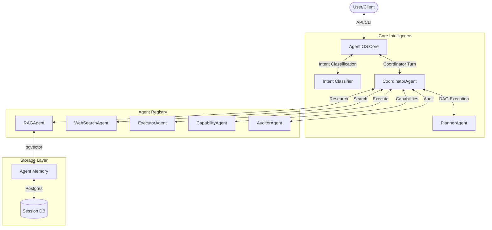

# Agentic OS: The System of Systems

Welcome to the **Agentic OS** ecosystem. This project provides a production-grade, modular AI operating system designed for local execution with high concurrency, strong security, and resilient reasoning.

## 🏛️ Architecture Overview

Agentic OS is structured as a "System of Systems," decoupling core reasoning from memory and capability management.



### Main Components

- **[Core & Coordinator](agent_core/)**: The primary entry point and reasoning engine. Handles intent classification and agent routing.
- **[Autonomous Agents](agents/)**: specialized modular agents (RAG, Executor, Planner, Auditor, etc.) each with a strict domain and risk profile.
- **[Agent Memory](agent_memory/)**: The semantic storage layer. Managed `pgvector` RAG, semantic caching, and tree-store persistence.
- **[Database Layer](db/)**: Clean SQL-based command and query interfaces for all system state.
- **[System Prompts](prompts/)**: Standardized system instructions for all active agents.

---

## 🌟 Key Features

- **Intent-Driven Routing**: Microsecond classification of user intent (Capability, RAG, Web, Code, etc.) bypasses unnecessary planning.
- **Risk-Gated Execution**: LOW risk commands execute directly; HIGH risk commands are blocked for explicit human approval.
- **Resilient RAG**: 3-layer retrieval (Cache -> Vector -> Web Fallback) with a strict "single-search" circuit breaker.
- **Strict Architecture**: Zero-knowledge separation between agents ensures no recursive loops or uncontrolled reasoning depth.
- **Local-First**: Optimized for local inference using Ollama or LlamaCPP backends via the LLM router.

---

## 🚀 Quickstart

1. **Environment Setup**:
   ```bash
   cp .env.example .env
   # Configure LLM_MODEL, OLLAMA_URL, and POSTGRES_URL
   ```

2. **Start Infrastructure**:
   ```bash
   docker-compose up -d
   ```

3. **Run the OS (Backend)**:
   ```bash
   python gateway/main.py serve
   ```

4. **Run the UI (Optional)**:
   ```bash
   python ui/app.py
   ```

---

## 📚 Navigation & Docs

- **[Agent Guidelines](AGENTS.md)**: Coding standards and boundaries for system development.
- **[Database Schema](db/schema.sql)**: The underlying data model for chains, nodes, and memory.
- **[Technical Specification](docs/architecture.md)**: Deep dive into the system-of-systems design.

---

## 🛠️ Development

See [development setup](docs/architecture.md#development-setup) for details on testing, linting, and local debugging.
Always run `pytest` before submitting changes.
