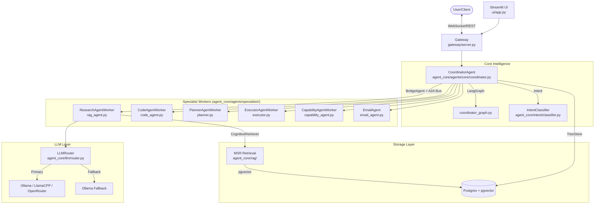

# Agentic OS: The System of Systems

Welcome to **Agentic OS** — a production-grade, modular AI operating system designed for local execution with high concurrency, strong security, and resilient reasoning.

## Monitoring & Health

Agentic OS includes a Redis-based heartbeat system to ensure specialists are online before dispatch.

- **Check Heartbeat**: The `BridgeAgent` (`agent_core/agents/core/coordinator.py`) calls `bus.get_heartbeat(role)` before every task dispatch — offline specialists are rejected immediately, not after a 600s timeout.
- **Docker Health**: Individual services use this same check in `docker-compose.yml`.

## Hardened Runtime Features

Agentic OS implements advanced reliability patterns to handle complex, multi-turn technical research without context loss or "Ghost Worker" interruptions.

- **Sticky Specialist Routing**: The Coordinator preserves the active specialist session across turn-based confirmations.
- **Goal Shield (Phase 88/117)**: An unconditional "Goal Restoration" logic that prevents technical queries from being overwritten by short affirmations (e.g., "yes").
- **Sequential Research Autonomy**: Specialists (like RAG) can auto-advance through multi-part goals without constant user input.
- **Context Isolation**: A "Current Session Priority" mode that strictly partitions semantic search, preventing cross-session memory bleed.
- **Structural Yielding**: Capability agents use `NOT_CAPABILITY` signals to instantly hand off technical research to the RAG specialist.

## Architecture Overview



### Main Components

| Component | Path | Role |
|---|---|---|
| **Gateway** | `gateway/server.py` | FastAPI WebSocket + REST entry point |
| **CoordinatorAgent** | `agent_core/agents/core/coordinator.py` | LangGraph orchestrator + BridgeAgent dispatcher |
| **Specialist Workers** | `agent_core/agents/specialists/` | RAG, Code, Email, Planner, Executor, Capability, Productivity |
| **CognitiveRetriever** | `agent_core/rag/cognitive_retriever.py` | Bandit-driven MSR retrieval (Memory + Skills + Relational) |
| **LLMRouter** | `agent_core/llm/router.py` | Micro-batching LLM client with fallback |
| **A2A Bus** | `agent_core/agents/core/a2a_bus.py` | Redis pub/sub for task dispatch and thought streaming |
| **TreeStore** | `db/queries/commands.py` | Postgres-backed durable execution tree |
| **RL Router** | `rl_router/domain/bandit.py` | LinUCB bandit (embedded in CognitiveRetriever) |

---

## Key Features

- **Intent-Driven Routing**: Fast intent classification (`agent_core/intent/classifier.py`) routes requests to the right specialist without unnecessary planning overhead.
- **Adaptive RAG Depth**: An embedded `LinUCBBandit` (`rl_router/domain/bandit.py`) learns the optimal retrieval strategy (8 arms from shallow to deep) per query, driven by intent + session features.
- **Fail-Fast Dispatch**: Redis heartbeat check before every specialist dispatch — no silent hangs.
- **Multi-Layer Retrieval**: `CognitiveRetriever` runs Memory + Skills + Relational layers in parallel, fused with RRF.
- **ReAct Loop Hardening**: Last-turn nudges, empty-response guards, and no-action recovery nudges prevent reasoning loops from stalling.
- **Cloud + Local Failover**: `LLMRouter` automatically fails over from OpenRouter/OpenAI to local Ollama on 401/429 errors.
- **Local-First Privacy**: All inference, embeddings, and storage are local by default.

---

## Repository Layout

| Directory | Description |
|---|---|
| `agent_core/` | Primary package — orchestration, RAG, LLM, intent, graph, tools, security |
| `agent_core/agents/core/` | Coordinator, BridgeAgent, A2ABus, AgentWorker |
| `agent_core/agents/specialists/` | All specialist worker implementations |
| `agent_core/rag/` | CognitiveRetriever, Embedder, VectorStore, RAGStore, RetrievalPolicy |
| `agent_core/llm/` | LLMRouter, LLMClient, Model tiers, Backends |
| `assets/prompts/` | System prompts for all agents (coordinator, RAG, code, etc.) |
| `gateway/` | FastAPI entry point |
| `db/` | TreeStore, models, queries |
| `rl_router/` | Standalone RL service (LinUCB, rewards, drift, refinement) |
| `ui/` | Streamlit frontend |
| `infra/` | Docker, `.env` templates |
| `tests/` | Unit and integration tests |

For a detailed map, see [docs/repo-layout.md](docs/repo-layout.md) and [docs/canonical-package-map.md](docs/canonical-package-map.md).

---

## Getting Started

1. **Environment Setup**:
   ```bash
   cp .env.example .env
   # Configure: LLM_MODEL, OLLAMA_URL, POSTGRES_URL, REDIS_URL
   ```

2. **Start Infrastructure** (Postgres + Redis + Ollama):
   ```bash
   docker-compose up -d
   ```

3. **Run the Backend**:
   ```bash
   uvicorn gateway.server:app --host 0.0.0.0 --port 8000
   ```

4. **Run the UI** (optional):
   ```bash
   streamlit run ui/app.py
   ```

5. **Start Specialist Workers** (each in a separate terminal or via Docker):
   ```bash
   python -m agent_core.agents.specialists.rag_agent
   python -m agent_core.agents.specialists.code_agent
   # ... etc
   ```

---

## Documentation Index

| Doc | Description |
|---|---|
| [01 — Vision & Use Cases](docs/01-vision-use-cases.md) | Goals and use-case examples |
| [02 — Architecture](docs/02-architecture.md) | Component diagram and interaction flow |
| [03 — Data Model & RAG](docs/03-data-model-and-rag.md) | DB schema, CognitiveRetriever pipeline |
| [04 — Security](docs/04-security-and-sandboxing.md) | Auth, risk tiers, fail-fast, circuit breaker |
| [05 — LLM & Skills](docs/05-llm-and-skills.md) | LLMRouter, backends, ReAct loop hardening |
| [06 — RL Router](docs/06-rl-router.md) | LinUCB bandit, arms, reward signal |
| [Agent Roles & Workers](docs/agent-roles-and-workers.md) | Specialist mapping, dispatch, node lifecycle |
| [Canonical Package Map](docs/canonical-package-map.md) | Importable namespaces and canonical paths |
| [Repo Layout](docs/repo-layout.md) | On-disk directory structure |
| [API Reference](docs/api.md) | WebSocket, REST, A2A Bus, batch inference |
| [Architecture Deep-Dive](docs/architecture.md) | Subsystem details and data flow |

Always run `pytest` before submitting changes.

