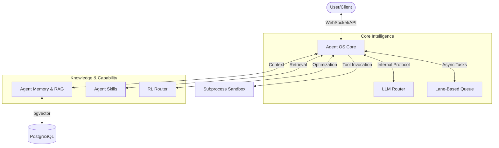

# Agentic OS: The System of Systems

Welcome to the **Agentic OS** ecosystem. This project provides a distributed, modular AI operating system designed for local execution with high concurrency, strong security, and resilient reasoning.

## 🏛️ Architecture Overview

Agentic OS is structured as a "System of Systems," decoupling core reasoning from memory and capability management.



### Main Components

- **[Agent OS Core](agentos_core/)**: The reasoning hub. Manages ReAct loops and secure tool sandboxing.
- **[Agent Memory](agentos_memory/)**: The semantic storage layer. Handles `pgvector` RAG and long-term history.
- **[Agent Skills](agentos_skills/)**: The capability registry. Indexes and retrieves specialized behaviors.
- **[RL Router](agentic_rl_router/)**: Multi-objective contextual bandit for dynamic RAG depth optimization.

---

## 🌟 Key Features & Skills

- **Centralized LLM Router**: Micro-batching for high-throughput local inference (Ollama/vLLM).
- **Resilient RAG**: Multi-tiered retrieval (Fractal, GraphRAG) with explicit validation layers.
- **Lane-Based Execution**: Durable, ordered command processing via DB-backed queues.
- **Capability Discovery**: Automatic indexing of `SKILL.md` packages for modular expansion.
- **Secure Sandboxing**: Isolated subprocess execution for risky filesystem and shell operations.

---

## 🌊 Main Flows

### 1. User Request Flow

`User` → `WebSocket (/chat)` → `ReAct Agent (Core)` → `Skill/Memory Retrieval` → `Reasoning Step` → `Tool Execution (Sandbox)` → `Streaming Response`.

### 2. Skill Lifecycle

`Local SKILL.md` → `Skill Indexer` → `Vector Store (pgvector)` → `Semantic Discovery` → `Context Injection`.

---

## 🔌 API Endpoints (Core)

| Path | Method | Purpose | Example |
| :--- | :--- | :--- | :--- |
| `/chat` | `WS` | Streaming ReAct chat with session persistence | `{"message": "Check docker status"}` |
| `/health` | `GET` | Service readiness check | `curl localhost:8000/health` |
| `/embed` | `POST` | Generate embeddings for arbitrary text | `{"text": "Hello world"}` |
| `/skills/reindex` | `POST` | Trigger recursive skill discovery | `curl -X POST .../reindex` |

---

## 🚀 Quickstart

1. **Environment Setup**:

   ```bash
   cp .env.example .env
   # Configure LLM_MODEL, OLLAMA_URL, and POSTGRES_URL
   ```

2. **Start Infrastructure**:

   ```bash
   docker-compose up -d
   ```

3. **Run the OS (Backend)**:

   ```bash
   cd agentos_core
   python main.py serve
   ```

4. **Run the Web UI**:
   - In a new terminal, start the Streamlit frontend. This connects to the `main.py serve` backend via WebSocket:

   ```bash
   cd agentos_ui
   streamlit run app.py
   ```

---

## 📚 Navigation & Docs

- **[Capabilities Registry](skill.md)**: Full list of system skills and their implementation.
- **[Architecture Decision Records](docs/adr/)**: History of major design choices.
- **[Data Model & RAG](docs/03-data-model-and-rag.md)**: Deep dive into the memory schema.
- **[RL Router Specs](docs/06-rl-router.md)**: Details on the contextual bandit logic.
- **[Internal API Reference](docs/api.md)**: Full API documentation.
- **[Security & Sandboxing](docs/04-security-and-sandboxing.md)**: Isolation protocols.

---

## 🛠️ Development

See [development setup](agentos_core/docs/architecture.md#development-setup) for details on testing, linting, and local debugging.
