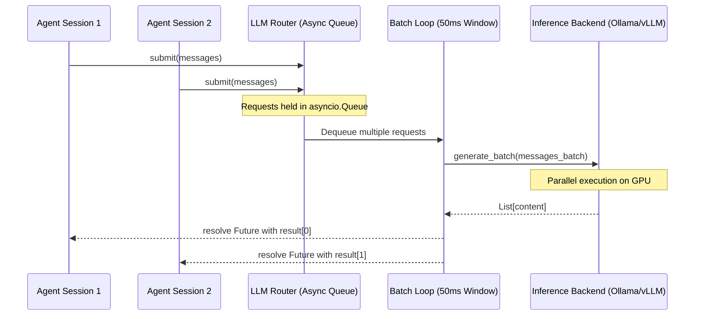

# LLM Router Architecture

The `llm_router` implements a **collect-and-dispatch** pattern to maximize local GPU utilization.

## Flow Diagram

## Internal Components

### 1. The Queue (`asyncio.Queue`)

A thread-safe, non-blocking queue that holds `LLMRequest` objects. This allows the ReAct loops to continue processing (e.g., updating UI or logs) while waiting for inference.

### 2. The Batch Loop (`_batch_loop`)

A persistent background task that:

- Waits for the first item in the queue.
- Once an item arrives, it waits up to `ROUTER_BATCH_INTERVAL_MS` to gather more requests.
- Groups requests by model and parameters (temperature, max_tokens) to ensure backend compatibility.

### 3. Backend Adapters (`backend.py`)

Abstracts the specific inference engine.

- **OllamaBackend**: Uses the Ollama API's batching capabilities or parallelizes requests.
- **vLLMBackend**: Leverages vLLM's continuous batching for maximum throughput.

## Data Model

- **LLMRequest**: request_id, messages, model, temperature, max_tokens.
- **LLMResponse**: request_id, content, error (if any).
- **BatchGroup**: A collection of requests sharing identical model parameters.
