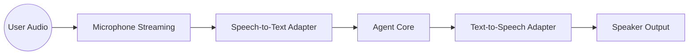

# Voice Pipeline — Architecture

## Purpose

The `voice` module handles streaming audio processing, enabling the agent to interact via speech. It isolates hardware and cloud-specific speech APIs from the core reasoning loop.

## System Architecture

## Core Components

### 1. `adapter.py` (ASR/TTS Interface)

Defines the standard interface for speech providers. It allows switching between local models (e.g., Whisper, Piper) and cloud services (e.g., Google Cloud Speech, OpenAI Whisper API) without changing the agent's logic.

### 2. `stream.py` (Buffer Management)

Handles real-time audio chunking and circular buffering. It ensures low-latency delivery of audio data to the ASR engine and manages playback synchronization for the TTS engine.

## Data Flow Paths

1. **The Inbound Path**: Audio Frame $\rightarrow$ `stream.py` $\rightarrow$ `ASR Adapter` $\rightarrow$ Text Transcription $\rightarrow$ Agent `run_turn_async`.
2. **The Outbound Path**: Agent Response $\rightarrow$ `TTS Adapter` $\rightarrow$ `stream.py` $\rightarrow$ Audio Playback.

## Design Principles

- **Stream-First**: All audio processing must be asynchronous and non-blocking to prevent "stuttering" during reasoning.
- **Provider Agnostic**: The core loop only interacts with transcribed text and synthesized audio buffers, never with specific API SDKs.
- **Low Latency**: Priority is given to responsiveness, using streaming VAD (Voice Activity Detection) to trigger transcription as early as possible.

## External Dependencies

- **PyAudio / SoundDevice**: For local audio I/O.
- **Ollama (Whisper)**: For local transcription.
- **Piper / eSpeak**: For local synthesis.
