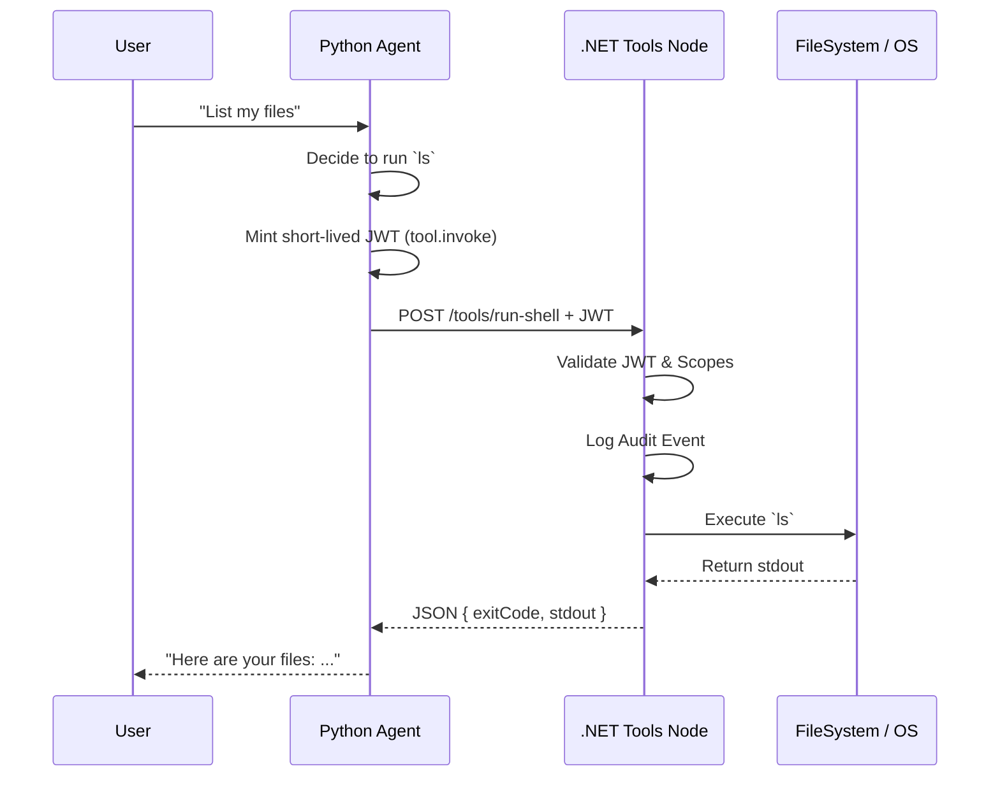

# Architecture Overview

The OpenClaw .NET Tools Node employs a **Sidecar Pattern**. The core Python AI Agent (`OpenClawAgent`) makes HTTP requests to this node for any system interaction. This isolates high-risk system access from the untrusted LLM environment.

## Components & Data Flow

## Key Infrastructure

- **ASP.NET Core 10.0 Minimal APIs**: Used for lightweight, performant endpoints without the ceremony of MVC Controllers.
- **Authentication**: `Microsoft.AspNetCore.Authentication.JwtBearer` ensures that no tools can be executed without a valid signed token mapping to explicitly allowed `scopes`.
- **Python Client**: A lightweight wrapper using `PyJWT` handles token minting on the fly just-in-time for standard and elevated operations.
