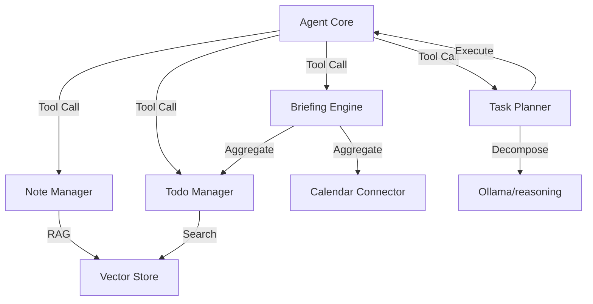

# Personal Productivity — Architecture

## Purpose

The `productivity` module enables the agent to act as a "Personal Assistant". it manages tasks, notes, and schedules, providing a specialized PKM (Personal Knowledge Management) environment.

## System Architecture

## Core Components

### 1. `todo_manager.py` (Task Management)

Manages a prioritized list of tasks. It uses semantic search (via `pgvector`) to find related tasks and prevents duplicates. It supports deadlines, tags, and status tracking.

### 2. `notes.py` (PKM Engine)

Handles the ingestion and retrieval of personal knowledge. It uses Markdown-aware chunking and high-density vector indexing to allow the agent to answer questions based on the user's private notes.

### 3. `briefing.py` (Information Synthesis)

Aggregates information from various connectors (Calendar, Tasks, Weather) and uses the Agent's LLM to generate a personalized "Morning Briefing".

### 4. `task_planner.py` (Goal Decomposition)

Takes a high-level user goal (e.g., "Plan a trip to Japan") and decomposes it into executable steps that can be dispatched back to the agent's tool registry.

## Data Flow Paths

1. **The Briefing Flow**: Cron/User Trigger $\rightarrow$ `briefing.py` $\rightarrow$ Fetch Todos + Calendar $\rightarrow$ LLM Synthesis $\rightarrow$ User Notification.
2. **The RAG Flow**: User Question $\rightarrow$ `notes.py` $\rightarrow$ Semantic Query to Vector Store $\rightarrow$ Context Building $\rightarrow$ LLM Response.

## Design Principles

- **Privacy First**: All notes and schedules are stored locally in the `agentos_memory` instance.
- **Semantic Continuity**: Tasks and notes are interlinked via the vector space, allowing the agent to find "relevant todos" while reading a note.
- **Decomposition**: Complex goals must be broken into atomic `PlanStep` objects before execution.

## External Dependencies

- **PostgreSQL (pgvector)**: Primary store for tasks and notes.
- **Google/Outlook Calendar**: Optional external connectors.
- **Weather/News APIs**: Used for briefing enrichment.
