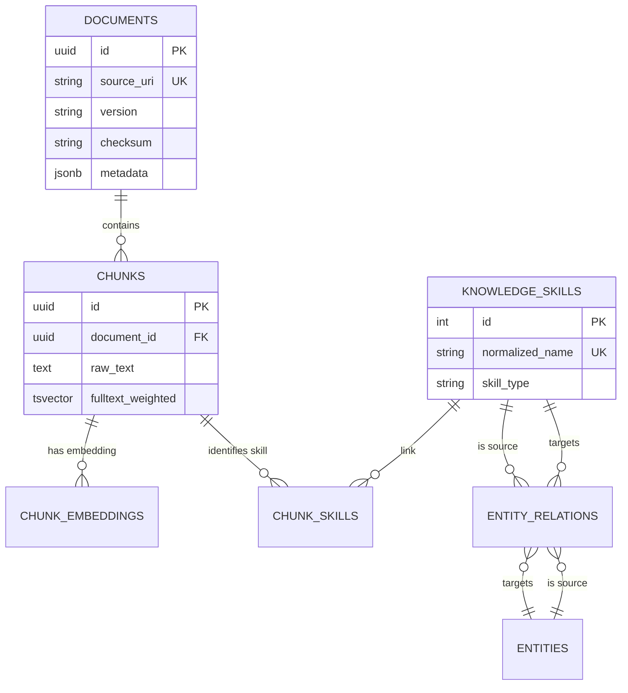

# Agent OS Memory: Architecture

## Overview

**Agent OS Memory** is the subsystem responsible for maintaining the agent's long-term memory, knowledge context, and transactional history. it utilizes a dual-storage approach: **Structured Relational Storage (SQL)** and **Unstructured Semantic Storage (Vector RAG)**.

## Main Components

### 1. [Agent Memory (SQL)](file:///c:/Users/savya/projects/agentic_os/agentos_memory/agent_memory)

The transactional backbone. It stores session histories, event logs, execution chains, and tool metadata. It uses PostgreSQL for robust relational indexing.

### 2. [Agent RAG (Vector)](file:///c:/Users/savya/projects/agentic_os/agentos_memory/agent_rag)

The semantic retrieval engine. It manages the ingestion of documents, their decomposition into chunks, and the generation of embeddings (via pgvector) for high-fidelity context retrieval.

## Data Models

### RAG Skill Graph (ER Model)

### Retrieval Patterns

1. **Hybrid Retrieval**: A weighted combination of pgvector cosine similarity (`chunk_embeddings`) and PostgreSQL Full-Text Search (`chunks.fulltext_weighted`). This allows the agent to handle both semantic ambiguity and keyword precision.
2. **Skill Graph Traversal**: The `entity_relations` table enables the agent to discover prerequisite or related skills (e.g., "Skill A REQUIRES Skill B"). This is used for upskilling workflows and autonomous curriculum generation.
3. **Provenance & Validation**: Every retrieved chunk is tied back to a `document_id` and `version`, allowing the **Auditor** agent to fact-check the LLM output against the specific clean text of the original source.

## Interaction Pattern

The **Core** interacts with **Memory** through two primary interfaces:

1. **Direct SQL**: For state management, logging, and history playback (`agent_memory.db`).
2. **Semantic & Hybrid Search**: For context recall and skill discovery (`agent_memory.rag_store`).
