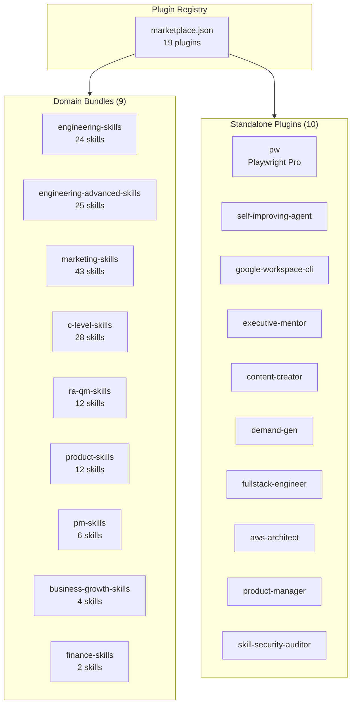

<div class="skills-hero" markdown>

# Plugins & Marketplace

**19 installable plugins** — domain bundles and standalone packages distributed via Claude Code plugin registry and ClawHub.

<p class="skills-hero-sub">Install entire skill domains or individual tools with a single command. Compatible with Claude Code, OpenAI Codex, Gemini CLI, and OpenClaw.</p>

</div>

---

## At a Glance

<div class="grid cards" markdown>

-   :material-puzzle-outline:{ .lg .middle } **19 Plugins**

    ---

    9 domain bundles + 10 standalone packages

-   :material-domain:{ .lg .middle } **9 Domains**

    ---

    Engineering, Marketing, Product, C-Level, PM, RA/QM, Business, Finance

-   :material-toolbox-outline:{ .lg .middle } **177 Skills**

    ---

    All skills available through plugin install

-   :material-sync:{ .lg .middle } **4 Platforms**

    ---

    Claude Code, Codex CLI, Gemini CLI, OpenClaw

</div>

---

## Quick Install

=== "Claude Code"

    ```bash
    # Install a domain bundle
    claude /plugin install marketing-skills

    # Install a standalone plugin
    claude /plugin install pw
    ```

=== "Codex CLI"

    ```bash
    # Clone the repository
    git clone https://github.com/alirezarezvani/claude-skills.git

    # Symlinks are pre-configured in .codex/skills/
    ```

=== "Gemini CLI"

    ```bash
    # Clone and run the sync script
    git clone https://github.com/alirezarezvani/claude-skills.git
    cd claude-skills
    python3 scripts/sync-gemini-skills.py --verbose
    ```

=== "OpenClaw"

    ```bash
    curl -sL https://raw.githubusercontent.com/alirezarezvani/claude-skills/main/scripts/openclaw-install.sh | bash
    ```

---

## Plugin Architecture



---

## Domain Bundles

Domain bundles install an entire skill domain with all its tools, references, and assets. Use these when you want comprehensive coverage for a functional area.

### :material-code-braces: Engineering — Core

| | |
|---|---|
| **Plugin** | `engineering-skills` |
| **Skills** | 24 |
| **Install** | `claude /plugin install engineering-skills` |

Architecture, frontend, backend, fullstack, QA, DevOps, security, AI/ML, data engineering, Playwright Pro (9 sub-skills), self-improving agent, Stripe integration, TDD guide, tech stack evaluator, Google Workspace CLI.

[:octicons-arrow-right-24: Browse skills](../skills/engineering-team/index.md)

---

### :material-rocket-launch: Engineering — POWERFUL

| | |
|---|---|
| **Plugin** | `engineering-advanced-skills` |
| **Skills** | 25 |
| **Install** | `claude /plugin install engineering-advanced-skills` |

Agent designer, RAG architect, database designer, migration architect, observability designer, dependency auditor, release manager, API reviewer, CI/CD pipeline builder, MCP server builder, skill security auditor, performance profiler.

[:octicons-arrow-right-24: Browse skills](../skills/engineering/index.md)

---

### :material-bullhorn-outline: Marketing

| | |
|---|---|
| **Plugin** | `marketing-skills` |
| **Skills** | 43 |
| **Install** | `claude /plugin install marketing-skills` |

Content, SEO, CRO, Channels, Growth, Intelligence, Sales enablement, and X/Twitter growth. 51 Python tools, 73 reference docs across 7 specialist pods.

[:octicons-arrow-right-24: Browse skills](../skills/marketing-skill/index.md)

---

### :material-account-tie: C-Level Advisory

| | |
|---|---|
| **Plugin** | `c-level-skills` |
| **Skills** | 28 |
| **Install** | `claude /plugin install c-level-skills` |

Virtual board of directors (CEO, CTO, COO, CPO, CMO, CFO, CRO, CISO, CHRO), executive mentor, founder coach, board meetings, decision logger, scenario war room, competitive intel, M&A playbook, culture frameworks.

[:octicons-arrow-right-24: Browse skills](../skills/c-level-advisor/index.md)

---

### :material-shield-check-outline: Regulatory & Quality

| | |
|---|---|
| **Plugin** | `ra-qm-skills` |
| **Skills** | 12 |
| **Install** | `claude /plugin install ra-qm-skills` |

ISO 13485 QMS, MDR 2017/745, FDA 510(k)/PMA, GDPR/DSGVO, ISO 27001 ISMS, CAPA management, risk management, clinical evaluation for HealthTech/MedTech.

[:octicons-arrow-right-24: Browse skills](../skills/ra-qm-team/index.md)

---

### :material-lightbulb-outline: Product

| | |
|---|---|
| **Plugin** | `product-skills` |
| **Skills** | 12 |
| **Install** | `claude /plugin install product-skills` |

Product manager toolkit (RICE, PRDs), agile product owner, product strategist, UX researcher, UI design system, competitive teardown, landing page generator, SaaS scaffolder, product analytics, experiment designer, product discovery, roadmap communicator. 13 Python tools.

[:octicons-arrow-right-24: Browse skills](../skills/product-team/index.md)

---

### :material-clipboard-check-outline: Project Management

| | |
|---|---|
| **Plugin** | `pm-skills` |
| **Skills** | 6 |
| **Install** | `claude /plugin install pm-skills` |

Senior PM, scrum master, Jira expert, Confluence expert, Atlassian admin, template creator. 12 Python tools with Atlassian MCP integration.

[:octicons-arrow-right-24: Browse skills](../skills/project-management/index.md)

---

### :material-trending-up: Business & Growth

| | |
|---|---|
| **Plugin** | `business-growth-skills` |
| **Skills** | 4 |
| **Install** | `claude /plugin install business-growth-skills` |

Customer success manager, sales engineer, revenue operations, contract & proposal writer.

[:octicons-arrow-right-24: Browse skills](../skills/business-growth/index.md)

---

### :material-calculator-variant: Finance

| | |
|---|---|
| **Plugin** | `finance-skills` |
| **Skills** | 2 |
| **Install** | `claude /plugin install finance-skills` |

Financial analyst (ratio analysis, DCF valuation, budgeting, forecasting) and SaaS metrics coach (ARR, MRR, churn, CAC, LTV, NRR). 7 Python tools.

[:octicons-arrow-right-24: Browse skills](../skills/finance/index.md)

---

## Standalone Plugins

Standalone plugins install individual skills or toolkits. Use these when you need a specific capability without the full domain bundle.

<div class="grid cards" markdown>

-   :material-test-tube:{ .lg .middle } **Playwright Pro** `pw`

    ---

    Production-grade Playwright testing toolkit. 9 sub-skills, 3 agents, 55 templates, TestRail + BrowserStack MCP.

    ```bash
    claude /plugin install pw
    ```

    **Slash commands:** `/pw:generate`, `/pw:fix`, `/pw:review`, `/pw:migrate`, `/pw:coverage`, `/pw:init`, `/pw:report`, `/pw:testrail`, `/pw:browserstack`

-   :material-brain:{ .lg .middle } **Self-Improving Agent** `self-improving-agent`

    ---

    Auto-memory curation, learning promotion, and pattern extraction into reusable skills.

    ```bash
    claude /plugin install self-improving-agent
    ```

    **Slash commands:** `/si:review`, `/si:promote`, `/si:extract`, `/si:status`, `/si:remember`

-   :fontawesome-brands-google:{ .lg .middle } **Google Workspace CLI** `google-workspace-cli`

    ---

    Gmail, Drive, Sheets, Calendar, Docs, Chat, Tasks via the `gws` CLI. 5 Python tools, 43 recipes, 10 persona bundles.

    ```bash
    claude /plugin install google-workspace-cli
    ```

-   :material-account-supervisor:{ .lg .middle } **Executive Mentor** `executive-mentor`

    ---

    Adversarial thinking partner for founders. Pre-mortem, board prep, hard calls, stress tests, postmortems.

    ```bash
    claude /plugin install executive-mentor
    ```

    **Slash commands:** `/em:challenge`, `/em:board-prep`, `/em:hard-call`, `/em:stress-test`, `/em:postmortem`

-   :material-pencil:{ .lg .middle } **Content Creator** `content-creator`

    ---

    SEO-optimized content with brand voice analysis, content frameworks, and social media templates.

    ```bash
    claude /plugin install content-creator
    ```

-   :material-magnet:{ .lg .middle } **Demand Gen** `demand-gen`

    ---

    Multi-channel demand generation, paid media optimization, SEO strategy, and partnership programs.

    ```bash
    claude /plugin install demand-gen
    ```

-   :material-layers-triple:{ .lg .middle } **Fullstack Engineer** `fullstack-engineer`

    ---

    Full-stack engineering with React, Node, databases, and deployment patterns.

    ```bash
    claude /plugin install fullstack-engineer
    ```

-   :fontawesome-brands-aws:{ .lg .middle } **AWS Architect** `aws-architect`

    ---

    AWS serverless architecture with IaC templates, cost optimization, and CI/CD pipelines.

    ```bash
    claude /plugin install aws-architect
    ```

-   :material-clipboard-text:{ .lg .middle } **Product Manager** `product-manager`

    ---

    RICE scoring, customer interview analysis, and PRD generation toolkit.

    ```bash
    claude /plugin install product-manager
    ```

-   :material-shield-lock:{ .lg .middle } **Skill Security Auditor** `skill-security-auditor`

    ---

    Security scanner for AI agent skills. Detects malicious patterns, prompt injection, data exfiltration, and unsafe file operations.

    ```bash
    claude /plugin install skill-security-auditor
    ```

</div>

---

## Plugin Structure

Every plugin follows the same minimal schema for maximum portability:

```json
{
  "name": "plugin-name",
  "description": "What it does",
  "version": "2.1.2",
  "author": { "name": "Author Name" },
  "homepage": "https://...",
  "repository": "https://...",
  "license": "MIT",
  "skills": "./"
}
```

!!! info "ClawHub Registry"
    Plugins are distributed via [ClawHub](https://clawhub.com) as the public registry. The `cs-` prefix is used only when a slug is already taken by another publisher — repo folder names remain unchanged.

### Directory Layout

```
domain-name/
├── .claude-plugin/
│   └── plugin.json        # Plugin metadata
├── skill-a/
│   ├── SKILL.md           # Skill instructions
│   ├── scripts/           # Python CLI tools
│   ├── references/        # Knowledge bases
│   └── assets/            # Templates
├── skill-b/
│   └── ...
└── CLAUDE.md              # Domain instructions
```

---

## Compatibility Matrix

| Platform | Bundle Install | Standalone Install | Slash Commands | Agents |
|----------|:-:|:-:|:-:|:-:|
| **Claude Code** | :material-check: | :material-check: | :material-check: | :material-check: |
| **OpenAI Codex** | :material-check: | :material-check: | :material-close: | :material-close: |
| **Gemini CLI** | :material-check: | :material-check: | :material-close: | :material-close: |
| **OpenClaw** | :material-check: | :material-check: | :material-close: | :material-close: |

!!! tip "Full feature support"
    Slash commands (like `/pw:generate`) and agent spawning (like `cs-engineering-lead`) are Claude Code features. On other platforms, the underlying skills and Python tools work — just without the command/agent wrappers.

---

## All Plugins at a Glance

| Plugin | Type | Skills | Category | Keywords |
|--------|------|:------:|----------|----------|
| `marketing-skills` | Bundle | 43 | Marketing | content, seo, cro, growth, social |
| `c-level-skills` | Bundle | 28 | Leadership | ceo, cto, strategy, advisory |
| `engineering-advanced-skills` | Bundle | 25 | Development | agent, rag, database, ci-cd, mcp |
| `engineering-skills` | Bundle | 24 | Development | architecture, devops, ai, ml |
| `ra-qm-skills` | Bundle | 12 | Compliance | iso-13485, mdr, fda, gdpr |
| `product-skills` | Bundle | 12 | Product | pm, agile, ux, saas, analytics, experimentation, discovery, roadmap |
| `pm-skills` | Bundle | 6 | PM | scrum, jira, confluence |
| `business-growth-skills` | Bundle | 4 | Business | sales, revenue, customer-success |
| `finance-skills` | Bundle | 2 | Finance | dcf, valuation, saas-metrics |
| `pw` | Standalone | 9 | Development | playwright, e2e, testing |
| `self-improving-agent` | Standalone | 5 | Development | memory, auto-memory |
| `google-workspace-cli` | Standalone | 1 | Development | gmail, drive, sheets, calendar |
| `executive-mentor` | Standalone | 5 | Leadership | pre-mortem, board-prep |
| `content-creator` | Standalone | 1 | Marketing | seo, brand-voice |
| `demand-gen` | Standalone | 1 | Marketing | paid-media, acquisition |
| `fullstack-engineer` | Standalone | 1 | Development | react, node |
| `aws-architect` | Standalone | 1 | Development | aws, serverless, cloud |
| `product-manager` | Standalone | 1 | Product | rice, prd |
| `skill-security-auditor` | Standalone | 1 | Development | security, audit |

---

## FAQ

??? question "What's the difference between a bundle and a standalone plugin?"
    **Bundles** install all skills in a domain (e.g., `marketing-skills` installs all 43 marketing skills). **Standalone** plugins install a single skill or toolkit (e.g., `pw` installs just Playwright Pro). Standalone plugins are subsets of their parent bundle — installing both is safe but redundant.

??? question "Can I install multiple plugins?"
    Yes. Plugins are designed to coexist without conflicts. Each skill is self-contained with no cross-dependencies.

??? question "Do plugins require API keys or paid services?"
    No. All Python tools use stdlib only. Some skills reference external services (AWS, Google Workspace, Stripe) but follow a BYOK (bring-your-own-key) pattern — you use your own accounts.

??? question "How do I update plugins?"
    Re-run the install command. Plugins follow semantic versioning aligned with the repository releases (currently v2.1.2).

??? question "What is ClawHub?"
    [ClawHub](https://clawhub.com) is the public registry for Claude Code plugins. Think of it like npm for AI agent skills. The `cs-` prefix is used only when a plugin slug conflicts with another publisher.
