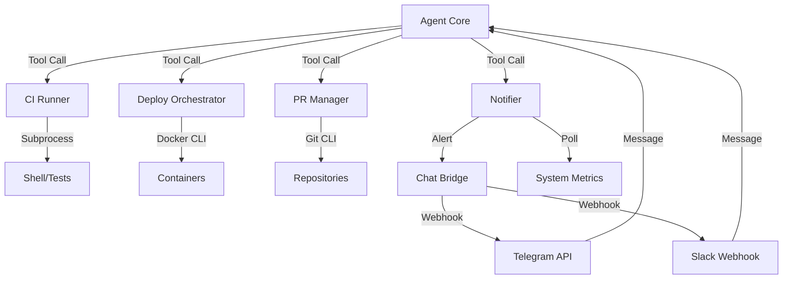

# DevOps Automation — Architecture

## Purpose

The `devops_auto` module provides the agent with "Engineer" capabilities. It handles technical operations involving codebases, infrastructure, and deployment pipelines, allowing the agent to self-heal and manage its own environment.

## System Architecture

## Core Components

### 1. `ci_runner.py` (Test Execution)

Executes local test suites (e.g., `pytest`, `npm test`) inside sandboxed environments. It parses raw terminal output into structured `TestRun` objects, extracting error messages and failure counts to allow the agent to "reason" about logs.

### 2. `pr_manager.py` (Git Operations)

Handles branch creation, diff application, and remote interaction. It abstracts raw `git` CLI calls into high-level methods like `apply_patch` or `open_pull_request`. It ensures that all git operations are performed within the designated workspace.

### 3. `deploy.py` (Orchestration)

Interacts with Docker, PM2, or Kubernetes to manage service lifecycles. It supports atomic rollbacks and health-check monitoring to ensure that new deployments do not degrade system stability.

### 4. `chat_bridge.py` (External Notification)

Allows the agent to send status updates or request human intervention via Slack or Telegram during long-running tasks. This is the primary channel for "Phone-driven Development".

## Data Flow Paths

1. **The Self-Heal Path**: CI failure $\rightarrow$ `ci_runner` report $\rightarrow$ Agent plan $\rightarrow$ `pr_manager` patch $\rightarrow$ `ci_runner` verification $\rightarrow$ Success notification.
2. **The Command Path**: Telegram/Slack message $\rightarrow$ `chat_bridge` $\rightarrow$ Agent Core $\rightarrow$ Action execution $\rightarrow$ Result sent back through the bridge.

## Design Principles

- **Idempotency**: Deployment and Git operations should be designed to handle retries without side-effects.
- **Isolation**: All tests and deployments must run in sandboxed containers (coordinated with `core/sandbox`).
- **Auditability**: Every git commit and deployment action is logged to the central `memory` for audit history.

## External Dependencies

- **Git CLI**: Must be available on the host or sandbox.
- **Docker/PM2**: Orchestration targets.
- **Telegram/Slack APIs**: Third-party messaging platforms.
