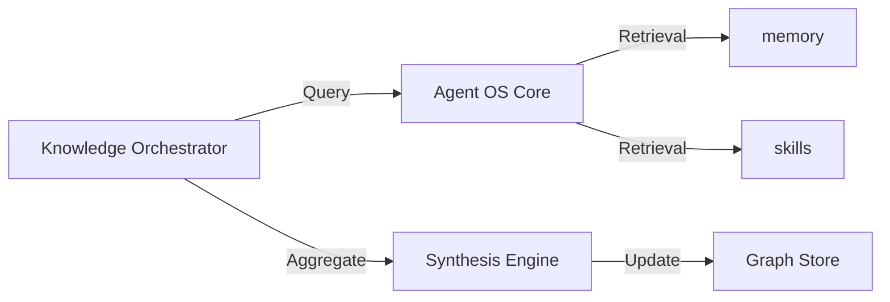

# Knowledge Orchestrator: Architecture

The `knowledge-orchestrator` is a meta-agent that synthesizes information across the Agent OS ecosystem.

## Component Overview

## Key Modules

- **Synthesis Engine**: Uses long-context LLMs to find contradictions or connections between different session histories and notes.
- **Entity Extractor**: Processes unstructured thoughts to populate a relational knowledge graph stored in `memory`.
- **Reporting Module**: Generates periodic "System State" and "Knowledge Map" reports for the user, highlighting missing documentation or skills.

## Retrieval Strategy

1. **Multi-Stage Recall**: Combines semantic search over `notes` with metadata filtering over `skills`.
2. **Context Compression**: Summarizes retrieved fragments to fit within the Core agent's reasoning window.
