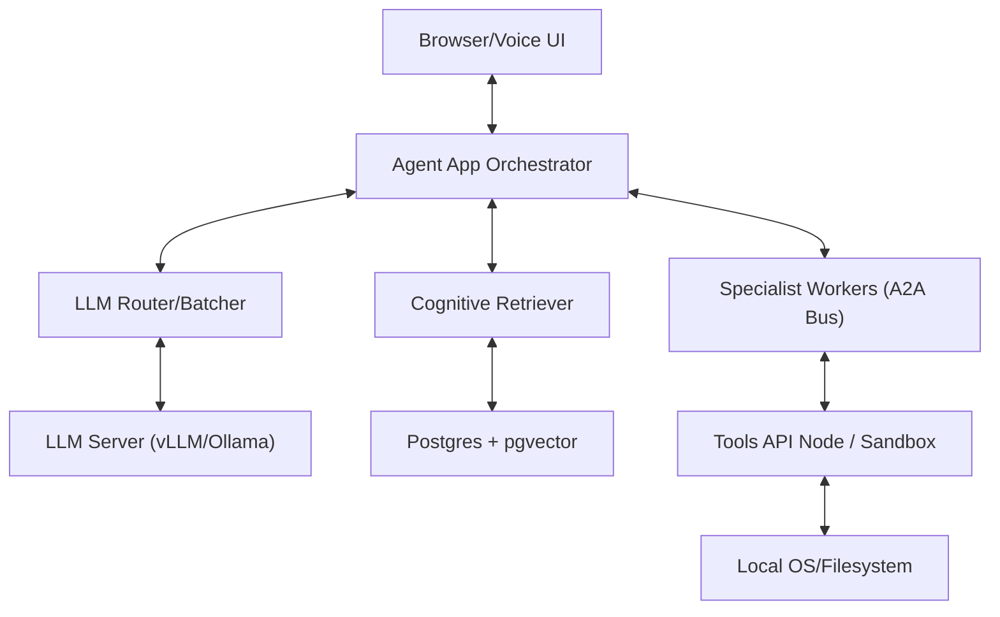

# 02 - System Architecture

## Architecture Overview

Local Agent OS is architected as a set of decoupled services coordinated by a central reasoning engine.

### Service Topology

### Component Details

1. **Agent App Orchestrator (`core`)**:
    - Manage state machine for each session.
    - Coordinate with Memory and Skills layers during the ReAct loop.
    - Dispatches actions to the Tools API via a durable queue.

2. **Cognitive Retriever (`agent_core/rag/cognitive_retriever.py`)**:
    - Single in-process component for all retrieval (replaces HybridRetriever).
    - Unified search across memory (thoughts), skills, and relational knowledge (CTE walk).
    - Uses MSR (Memory, Skills, Relational) layers with RRF (Reciprocal Rank Fusion).

3. **Specialist Workers (`agents/`)**:
    - Background processes for `rag`, `tools`, `schema`, `email`, `productivity`, `specialist`, and `planner`.
    - Dispatched via `BridgeAgent` using the Redis-based **A2A Bus**.
    - Implement a strict `Thought: / Action:` ReAct loop.

4. **Tools API Node (`agentos-tools-node`)**:
    - An isolated .NET 8 service that executes system commands.
    - Enforces security via JWT-scoped permissions and mTLS.

### Interaction Flows

#### Reasoning Loop (Simplified)

1. **User input** received via WebSocket.
2. **Context Retrieval**: App pulls relevant memories (from `memory`) and skills (from `skills`).
3. **Reasoning Turn**: App calls LLM through the Router to decide on the next action.
4. **Action Dispatch**: App enqueues a task in the `TreeStore` and notifies the specialist via the A2ABus.
5. **Execution**: The Specialist Worker (e.g., Code Agent) polls or listens for the task, executes it (optionally in a Sandbox), and updates the node status to `DONE`.
6. **Observation**: Result is fed back into the LangGraph coordinator for the next reasoning step.

> Last updated: arc_change branch
