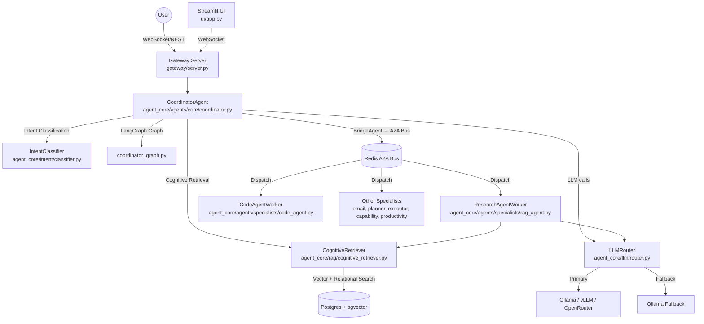

# 02 - System Architecture

## Architecture Overview

Agentic OS is a modular, local-first AI operating system structured as a coordinated set of decoupled services. The central orchestrator is a **LangGraph-based CoordinatorAgent** that classifies intent, routes tasks to background specialist workers, and collects results via the **A2A Bus** (Redis).

### Service Topology

### Component Details

1. **Gateway Server (`gateway/server.py`)**:
    - FastAPI/WebSocket server — the primary entry point for all client connections.
    - Handles session initialization, authentication, and routing to `CoordinatorAgent`.

2. **CoordinatorAgent (`agent_core/agents/core/coordinator.py`)**:
    - Classifies user intent via `agent_core/intent/classifier.py`.
    - Orchestrates the reasoning loop using a **LangGraph** state machine (`agent_core/graph/coordinator_graph.py`).
    - Dispatches tasks to specialist workers through `BridgeAgent` → `A2ABus` (Redis).
    - Manages role-based timeouts: RAG/Specialist=600s, others=300s.

3. **BridgeAgent (inner class of coordinator.py)**:
    - Creates a `Node` in the `TreeStore` (Postgres) with `PENDING` status.
    - Performs a **heartbeat check** against Redis before dispatch — fails fast if the specialist is offline.
    - Polls node status every 0.5s until `DONE` or `FAILED`, or until timeout.

4. **A2A Bus (`agent_core/agents/core/a2a_bus.py`)**:
    - Redis-backed publish/subscribe message bus.
    - Carries task payloads to specialist workers and streams `thought` events back to the coordinator for UI projection.

5. **Specialist Workers (`agent_core/agents/specialists/`)**:
    - Background processes implementing a strict **ReAct** (`Thought: / Action:`) loop.
    - Workers: `ResearchAgentWorker` (rag), `CodeAgentWorker` (tools), `CapabilityAgentWorker` (schema), `EmailAgent` (email), `PlannerAgentWorker` (planner), `ExecutorAgentWorker` (specialist), `ProductivityAgent` (productivity).
    - Workers listen for messages on the A2A Bus and update NodeStatus in the TreeStore when done.

6. **CognitiveRetriever (`agent_core/rag/cognitive_retriever.py`)**:
    - Single in-process retrieval component used by specialist workers (not the coordinator directly).
    - Selects a retrieval strategy via an embedded **LinUCB contextual bandit** (`rl_router/domain/bandit.py`).
    - Runs parallel **M**emory + **S**kills + **R**elational CTE layers, then RRF-fuses results.
    - Includes query rewriting, contextual neighbor expansion, and session episode injection.

7. **LLMRouter (`agent_core/llm/router.py`)**:
    - Priority queue with micro-batching across concurrent agent requests.
    - Supports three backends: **Ollama** (default), **LlamaCPP**, **OpenAI/OpenRouter**.
    - Implements automatic cloud-to-local fallback with a 5-minute cooldown on fatal errors (401/429).
    - Three model tiers: `NANO` (fast rewriting), `FAST` (intermediate), `FULL` (primary reasoning).

8. **TreeStore / DB (`db/`)**:
    - Postgres-backed durable execution tree: `chains` → `nodes`.
    - Every task dispatched through `BridgeAgent` is persisted as a `Node` with status lifecycle: `PENDING → RUNNING → DONE/FAILED`.

### Interaction Flow (Reasoning Loop)

1. **User** sends a message via WebSocket to `gateway/server.py`.
2. **CoordinatorAgent** classifies intent and builds an initial `AgentState`.
3. **LangGraph** executes the `coordinator_graph.py` state machine, routing to the appropriate specialist.
4. **BridgeAgent** checks specialist heartbeat, creates a `Node` in TreeStore, and publishes the task to the A2A Bus.
5. **Specialist Worker** picks up the task, runs its internal ReAct loop (LLM + tools), and marks the Node `DONE`.
6. **BridgeAgent** polls and returns the result to the LangGraph graph.
7. The **final response** is streamed back to the user via WebSocket.

> Last updated: arc_change branch — verified against source

