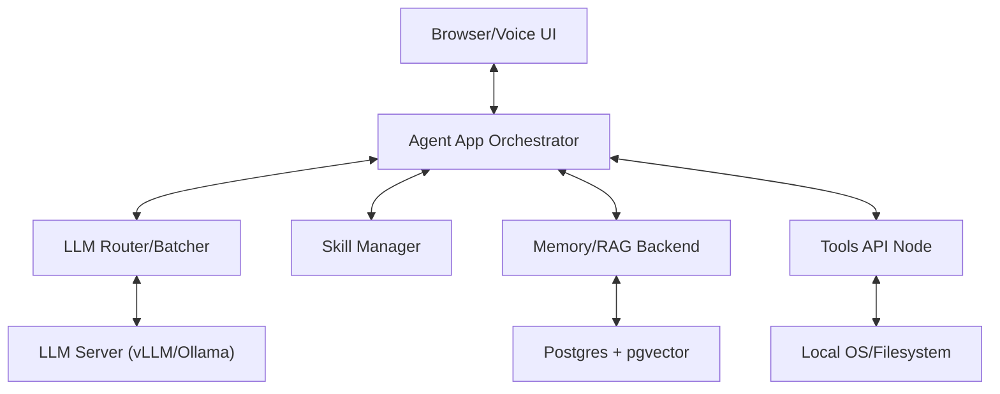

# 02 - System Architecture

## Architecture Overview

Local Agent OS is architected as a set of decoupled services coordinated by a central reasoning engine.

### Service Topology

### Component Details

1. **Agent App Orchestrator (`core`)**:
    - Manage state machine for each session.
    - Coordinate with Memory and Skills layers during the ReAct loop.
    - Dispatches actions to the Tools API via a durable queue.

2. **Memory & RAG Backend (`memory`)**:
    - Handles vector embeddings and similarity search.
    - Implements the "Gatekeeper" pattern to validate RAG outputs against source documents.

3. **Skill Manager (`skills`)**:
    - Dynamically loads and indexes Markdown-based skill definitions.
    - Provides a retrieval interface to inject relevant "reasoning recipes" into the prompt context.

4. **Tools API Node (`agentos-tools-node`)**:
    - An isolated .NET 8 service that executes system commands.
    - Enforces security via JWT-scoped permissions and mTLS.

### Interaction Flows

#### Reasoning Loop (Simplified)

1. **User input** received via WebSocket.
2. **Context Retrieval**: App pulls relevant memories (from `memory`) and skills (from `skills`).
3. **Reasoning Turn**: App calls LLM through the Router to decide on the next action.
4. **Action Dispatch**: App enqueues a tool call for the Tools API.
5. **Execution**: Tools API runs the command and returns the result.
6. **Observation**: Result is fed back into the reasoning turn for the next step or final output.
