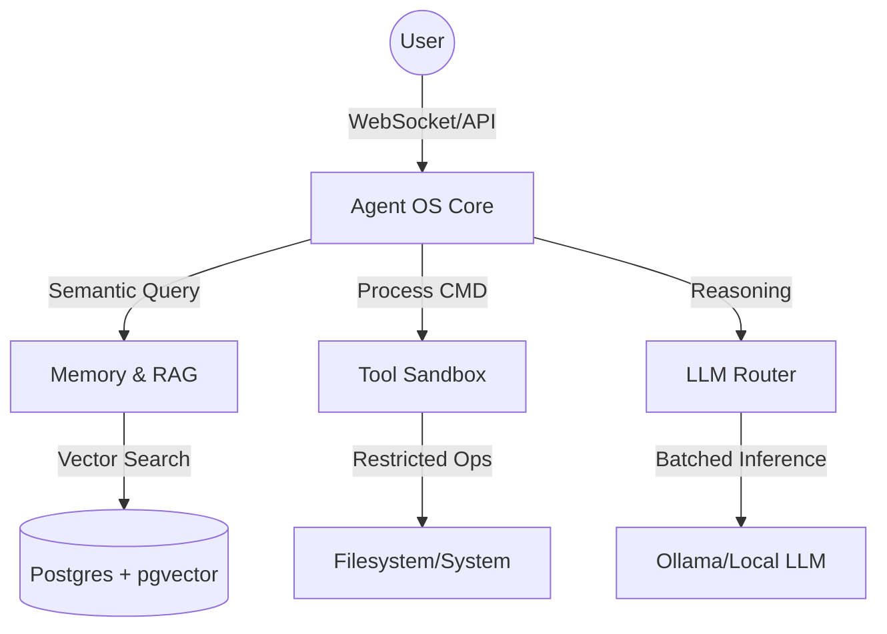

# Agent OS Appliance Architecture

The Agent OS Appliance is a modular, local-first AI system designed to run complex agentic workflows with high security, multi-session throughput, and durable memory.

## System Overview

The appliance is structured as a coordinated set of specialized subsystems, each acting as a distinct "bounded context" with its own API and data persistence rules.

## Core Subsystems

### 1. [Agent OS Core](file:///c:/Users/savya/projects/agentic_os/agentos_core/)

The central orchestration layer.

- **Agent Loop**: Implements the ReAct (Reasoning + Acting) loop.
- **Lane Queue**: Manages strictly ordered execution lanes for concurrent users.
- **LLM Router**: A high-performance proxy that batches token requests to the local inference engine.
- **RL Router**: Multi-objective contextual bandit that dynamically selects optimal RAG depth strategies to balance latency against hallucination risks.

### 2. [Memory & RAG](file:///c:/Users/savya/projects/agentic_os/agentos_memory/)

The long-term storage and knowledge retrieval engine.

- **Vector Store**: Manages embeddings for thoughts, chunks, and sessions.
- **RAG Pipeline**: A resilient "Verify-before-Generate" pipeline (Ingest -> Retrieve -> Validate).
- **History Compactor**: Summarizes conversation turns into stable session context.

### 3. [Skills Layer](file:///c:/Users/savya/projects/agentic_os/agentos_skills/)

The "knowledge modules" used by agents.

- **Skill Indexer**: Parses `SKILL.md` files into prompt-ready chunks.
- **Discovery Engine**: Ranks and selects skills based on "eval-lift" (cross-session utility).

## Data Flow: Reasoning Loop

1. **Input**: User sends a message via WebSocket.
2. **Context Retrieval**: Core asks Memory for relevant prior thoughts and Skills for relevant expertise.
3. **Reasoning**: Core sends a batched request to the LLM Router.
4. **Action**: If the LLM proposes a tool call, Core enqueues it in the Lane Queue.
5. **Execution**: The Sandbox worker executes the tool and returns the observation.
6. **Observation**: Core logs the result and returns to step 3 until a Final Answer is reached.

## Security Model

- **Identity**: Services authenticate internally via mTLS or shared JWT secrets.
- **Tool Policing**: Every tool call is audited and checked against a task-specific policy.
- **Isolation**: Shell and filesystem commands run in ephemeral subprocesses or containers.
