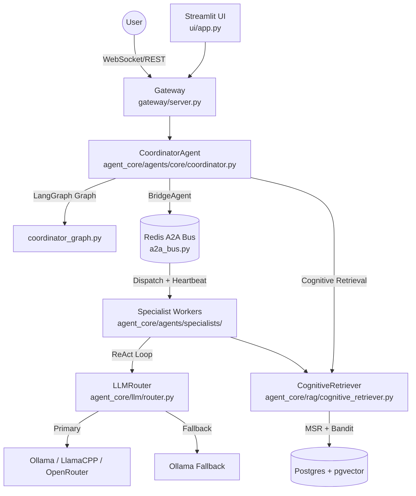

# Agent OS Appliance Architecture

The Agent OS Appliance is a modular, local-first AI system designed to run complex agentic workflows with high security, multi-session throughput, and durable memory.

## System Overview

The appliance is structured as a coordinated set of specialized subsystems. The **LangGraph-based CoordinatorAgent** is the central reasoning hub; all specialist work happens in isolated background processes connected via a **Redis A2A Bus**.

## Core Subsystems

### 1. CoordinatorAgent (`agent_core/agents/core/coordinator.py`)

The central orchestration and communication layer.

- **Intent Classification**: Calls `agent_core/intent/classifier.py:classify_intent()` → `Intent` enum.
- **LangGraph Orchestration**: Executes `agent_core/graph/coordinator_graph.py` — a typed `StateGraph` over `AgentState`.
- **Hardened Routing (Phase 88/117)**: 
    - **Goal Shield**: Unconditionally restores the technical goal if the user provides a short affirmation (e.g., "yes"), preventing context loss during planning turns.
    - **Routing Guard**: Forces the active specialist role if the user affirms a plan, preventing the LLM from accidentally switching to the `capability` agent during a research session.
- **BridgeAgent**: Inner class that dispatches tasks to specialists via `TreeStore` + `A2ABus`. Performs a Redis **heartbeat check** before dispatch.
- **RL Metadata**: Collects `rl_metadata` (arm_index, top_k, depth) across turns for future bandit reward reporting.
- **Thought Streaming**: Subscribes to all specialist `thought` events on the A2A Bus and forwards them to the client via `status_callback`.

### 2. Memory & Retrieval (`agent_core/rag/`)

The long-term storage and knowledge retrieval engine.

- **CognitiveRetriever** (`cognitive_retriever.py`): Single in-process component replacing `HybridRetriever`. Called by specialist workers (not the coordinator directly).
- **Bandit Strategy Selection**: Uses an embedded `LinUCBBandit` (8-arm) to pick the optimal retrieval strategy based on intent features (dimension-9 context vector).
- **MSR Layers**: Parallel **M**emory (thoughts), **S**kills (pgvector), **R**elational (recursive CTE walk over `skill_relations` / `entity_relations`).
- **RRF Fusion**: Reciprocal Rank Fusion across layers + 1.25× recency multiplier.
- **Neighbor Expansion**: Fetches ±1 adjacent `skill_chunks` for each matched skill result.
- **Query Rewriting**: LLM-assisted rewrite at `ModelTier.NANO` when session context exists.

### 3. Specialists (`agent_core/agents/specialists/`)

Autonomous background workers performing specific domain tasks over the ReAct loop.

| Role | Class | File |
|---|---|---|
| `rag` | `ResearchAgentWorker` | `rag_agent.py` |
| `tools` | `CodeAgentWorker` | `code_agent.py` |
| `schema` | `CapabilityAgentWorker` | `capability_agent.py` |
| `email` | `EmailAgent` | `email_agent.py` |
| `planner` | `PlannerAgentWorker` | `planner.py` |
| `specialist` | `ExecutorAgentWorker` | `executor.py` |
| `productivity` | `ProductivityAgent` | `productivity.py` |

Each worker: (1) listens on the A2A Bus, (2) runs a `Thought: / Action:` ReAct loop, (3) updates `NodeStatus` in the `TreeStore`.

### 4. LLM Router (`agent_core/llm/router.py`)

Priority-sorted micro-batching router.

- **Backends**: Ollama (default), LlamaCPP, OpenAI/OpenRouter — selected via `ROUTER_BACKEND` env var.
- **Failover**: Cloud backend failures (401/429) trigger automatic failover to local Ollama with a 5-minute cooldown.
- **Model Tiers**: `NANO` (rewriting), `FAST` (summaries), `FULL` (reasoning). `NANO` requests get priority elevation.

### 5. RL Router (`rl_router/`)

**Standalone** microservice — currently embedded in `CognitiveRetriever` as an in-process `LinUCBBandit`. See [`06-rl-router.md`](06-rl-router.md) for details.

## Data Flow: Reasoning Loop

1. **Input**: User sends a message via WebSocket → `gateway/server.py`.
2. **Classification**: `CoordinatorAgent` classifies intent via `IntentClassifier`.
3. **LangGraph**: `coordinator_graph.py` determines which specialist to call.
4. **Dispatch**: `BridgeAgent` checks heartbeat, creates a `Node` in TreeStore, publishes to A2A Bus.
5. **Worker Execution**: Specialist runs its ReAct loop (retrieval → LLM → tools), updates `NodeStatus.DONE`.
6. **Observation**: `BridgeAgent` polls the TreeStore and returns the node result.
7. **Final Answer**: Coordinator extracts `final_response` from `AgentState` and streams it to the client.

## Security Model

- **Identity**: Services authenticate via JWT tokens (gateway enforces auth).
- **Tool Policing**: Tool calls are audited against a task-specific risk policy (`RiskLevel.LOW/NORMAL/HIGH`).
- **Isolation**: Shell and filesystem commands run within the `sandbox/` execution environment.
- **Fail-Fast Dispatch**: Coordinator never blocks on offline specialists — heartbeat check before dispatch ensures immediate error responses instead of 600s timeouts.

> Last updated: arc_change branch — verified against source

