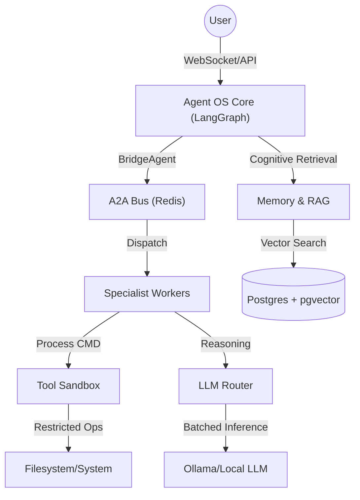

# Agent OS Appliance Architecture

The Agent OS Appliance is a modular, local-first AI system designed to run complex agentic workflows with high security, multi-session throughput, and durable memory.

## System Overview

The appliance is structured as a coordinated set of specialized subsystems, each acting as a distinct "bounded context" with its own API and data persistence rules.

## Core Subsystems

### 1. [Agent Core](agents/core/)

The central orchestration and communication layer.

- **CoordinatorAgent**: Orchestrates the ReAct loop via LangGraph and `BridgeAgent`.
- **TreeStore**: Asynchronous execution tree for cross-process task persistence.
- **BridgeAgent**: Dispatcher that manages the lifecycle of specialist tasks: `BridgeAgent` → `A2ABus` → `AgentWorker`.
- **Heartbeat Monitoring**: Specialist worker health check in `BridgeAgent.execute()` before dispatch.

### 2. [Memory & RAG](agent_core/rag/)

The long-term storage and knowledge retrieval engine.

- **CognitiveRetriever**: Single in-process component replacing `HybridRetriever`.
- **MSR Architecture**: Multi-layered search: **M**emory (thoughts), **S**kills (registry), **R**elational (recursive CTE walk).
- **RRF Fusion**: Reciprocal Rank Fusion of results with a recency multiplier.

### 3. [Specialists](agents/)

Autonomous workers that perform specific domain tasks.

- **Agent Roles**: Specialized workers for `rag`, `tools`, `schema`, `email`, `productivity`, `specialist`, and `planner`.
- **ReAct Loop**: Workers use a strict `Thought: / Action:` format.
- **Integration**: The `rl_router` service exists but is currently a standalone component NOT wired into the coordinator dispatch path.

## Data Flow: Reasoning Loop

1. **Input**: User sends a message via WebSocket/API.
2. **Context Retrieval**: Coordinator asks RAG specialist for relevant knowledge.
3. **Reasoning Turn**: Coordinator sends a batched request to the LLM.
4. **Action**: If the LLM proposes a tool call, Coordinator enqueues it in the TreeStore and notifies the specialist via A2ABus.
5. **Worker Execution**: The specialist (e.g., Code Agent) processes the task and updates its status.
6. **Observation**: Coordinator monitors status, logs result, and proceeds until a Final Answer.

## Security Model

- **Identity**: Services authenticate internally via mTLS or shared JWT secrets.
- **Tool Policing**: Every tool call is audited and checked against a task-specific policy.
- **Isolation**: Shell and filesystem commands run in ephemeral subprocesses or containers via the Sandbox.

> Last updated: arc_change branch
