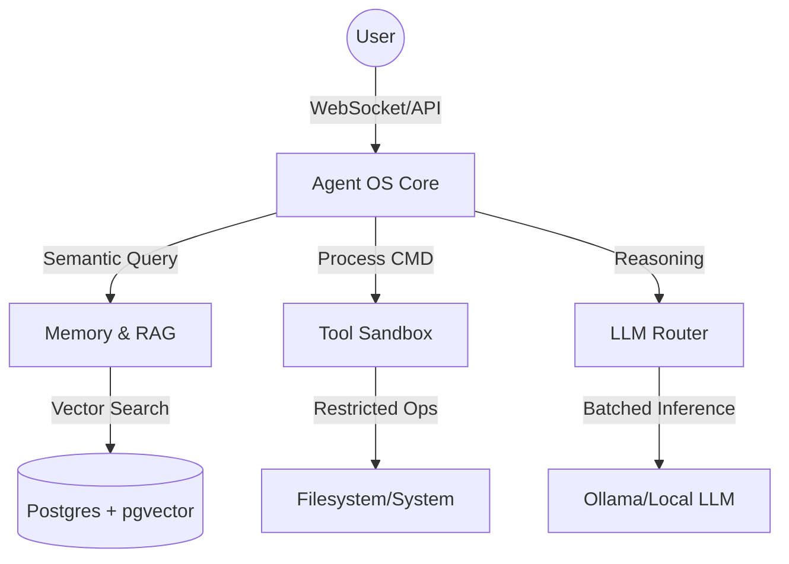

# Agent OS Appliance Architecture

The Agent OS Appliance is a modular, local-first AI system designed to run complex agentic workflows with high security, multi-session throughput, and durable memory.

## System Overview

The appliance is structured as a coordinated set of specialized subsystems, each acting as a distinct "bounded context" with its own API and data persistence rules.

## Core Subsystems

### 1. [Agent Core](agents/core/)

The central orchestration and communication layer.

- **CoordinatorAgent**: Orchestrates the ReAct loop and tool dispatch.
- **TreeStore**: Asynchronous execution tree for cross-process task persistence.
- **A2ABus**: Redis-based message bus for low-latency agent-to-agent signaling.
- **Heartbeat Monitoring**: Decoupled worker health tracking (30s TTL) with fail-fast logic in the Coordinator.

### 2. [Memory & RAG](rag/)

The long-term storage and knowledge retrieval engine.

- **HybridRetriever**: Unified search across skills, docs, and sessions.
- **Fail-Safe RAG**: Hardened retrieval with internal timeouts and non-blocking IO.
- **History Compactor**: Summarizes conversation turns into stable session context.

### 3. [Specialists](agents/specialists/)

Autonomous workers that perform specific domain tasks.

- **Segregated Workers**: RAG, Code Gen, Planner, and Capability workers run as distinct processes.
- **Status Telemetry**: Workers provide real-time reasoning progress updates to the TreeStore.

## Data Flow: Reasoning Loop (v2.6)

1. **Input**: User sends a message via WebSocket/API.
2. **Context Retrieval**: Coordinator asks RAG specialist for relevant knowledge via `A2ABus.send`.
3. **Reasoning Turn**: Coordinator sends a batched request to the LLM.
4. **Action**: If LLM proposes a tool call, Coordinator enqueues it in the `TreeStore` and notifies the specialist via `A2ABus.send`.
5. **Real-time Waiting**: Coordinator uses `A2ABus.wait_for_topic` to listen for a `node_done` event on the bus.
6. **Worker Execution**: The `AgentWorker` backbone processes the task, updates the DB, and **broadcasts** completion on the `node_done` channel.
7. **Observation**: Coordinator receives the notification instantly, retrieves the result from the DB, and proceeds to the next reasoning turn.

## Security Model

- **Identity**: Services authenticate internally via mTLS or shared JWT secrets.
- **Tool Policing**: Every tool call is audited and checked against a task-specific policy.
- **Isolation**: Shell and filesystem commands run in ephemeral subprocesses or containers.
