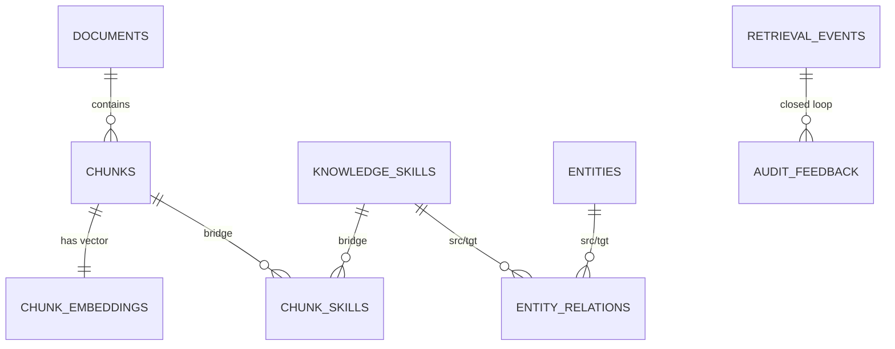

# Architecture: RAG Skill Graph & Memory Schema

This document outlines the design of the **Agentic OS Memory Layer**, specifically focusing on the RAG (Retrieval-Augmented Generation) schema and the Knowledge Graph that powers advanced upskilling and hybrid search.

## 1. Entity-Relationship Overview

The schema is built on three main pillars:

1. **Structure-Aware Storage**: Documents are decomposed into ordered, hierarchical chunks.
2. **Semantic & Lexical Indexing**: Every chunk is dual-indexed via `pgvector` (dense embeddings) and `tsvector` (full-text search).
3. **Knowledge Graph**: Canonical skills and entities are linked both to each other (relations) and to raw data (chunk bridges).

### Schema Diagram (Simplified)



## 2. Core Components

### Documents & Chunks

- **Documents**: Tracks source provenance (`source_uri`), provenance type (`source_type`), and versioning.
- **Chunks**: Preserves hierarchy via `section_path`. Uses a Postgres trigger to maintain a weighted `tsvector` for lexical search (Priority A: raw text, Priority B: LLM summary).

### Skill Graph

- **Knowledge Skills**: A curated taxonomy of capabilities (e.g., "Python", "RAG", "Kubernetes"). Slugified `normalized_slug` ensures uniqueness.
- **Entity Relations**: Supports graph traversals like `REQUIRES` or `PART_OF`. Enables the agent to "reason" across the documentation (e.g., "To learn X, I need to look at Y").

### Feedback Loop

- **Retrieval Events**: Logs every search query, the strategy used, and the latency.
- **Audit Feedback**: Allows the **Auditor Agent** to record quality scores and hallucination flags against specific retrieval runs, enabling continuous improvement.

## 3. High-Level Query Patterns

### Hybrid Search (Vector + Lexical)

We use a Reciprocal Rank Fusion (RRF) variant to combine `pgvector` cosine similarity and `ts_rank_cd` scores.

### 1-Hop Knowledge Traversal

Find all chunks related to a skill *and its prerequisites*:

```sql
SELECT c.raw_text 
FROM chunks c
JOIN chunk_skills cs ON c.id = cs.chunk_id
WHERE cs.skill_id IN (
    SELECT target_entity_id 
    FROM entity_relations 
    WHERE source_entity_id = :skill_id AND relation_type = 'REQUIRES'
);
```

## 4. Ingestion Workflow (worker.py)

1. **Parse**: Extract document structure.
2. **Chunk**: Generate structure-aware segments.
3. **Embed**: Produce 768-dim vectors via Ollama.
4. **Enrich**: Extract skills and entities using high-temp LLM calls.
5. **Upsert**: Populate the schema atomically.

---
*Maintained by the RAG Skill Graph & Storage Schema Architect.*
