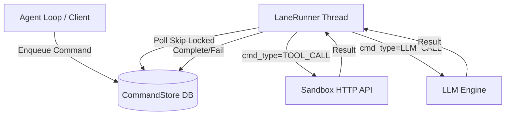

# Architecture Overview

`lane_queue` revolves around a Postgres layer (the `CommandStore`) and an execution daemon layer (the `LaneRunner`).

## Data Flow

## Subsystem Details

1. **The Store (`store.py`)**: Uses psycopg2 to mutate `lanes` and `commands` tables. Sequence numbers (`seq`) are strictly auto-incremented per lane to guarantee order.
2. **The Runner (`runner.py`)**: Continuously polls `commands` where status = pending. It locks the row to prevent other runners from fetching it, dispatches the handler based on `cmd_type`, and writes back the final state.
3. **The Models (`models.py`)**: Pydantic models abstracting the database schema into strictly typed Python objects like `Command` and `Lane`.
