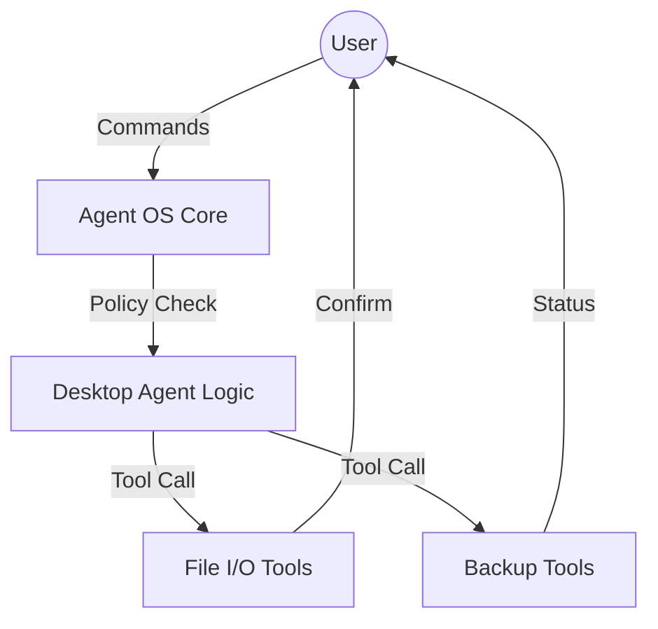

# Desktop Agent: Architecture

The `desktop-agent` is an application-layer service that orchestrates core-level tools for local automation.

## Component Map

## Security & Guardrails

- **Lanes**: High-risk tasks (e.g., mass file deletion) are placed in `high` risk lanes for manual queue inspection.
- **Authorizer**: JWTs are issued only for specific tool scopes, preventing privilege escalation.
- **Confirmation**: The `human_review` command type is used for all critical state changes (e.g., `rm`, `mv`).

## Core Workflows

### 1. File Organization

1. Target directory is scanned for new files.
2. File metadata (extension, contents) are sent to the LLM for categorization.
3. The agent proposes a move to the categorized subfolder.
4. User approves; file is moved.

### 2. Automated Backups

1. Scheduled triggers invoke the backup plan.
2. Agent verifies health of the target backup surface.
3. Rsync/Robocopy is executed via the `sandbox`.
4. Log summary is stored in `agentos_memory`.
