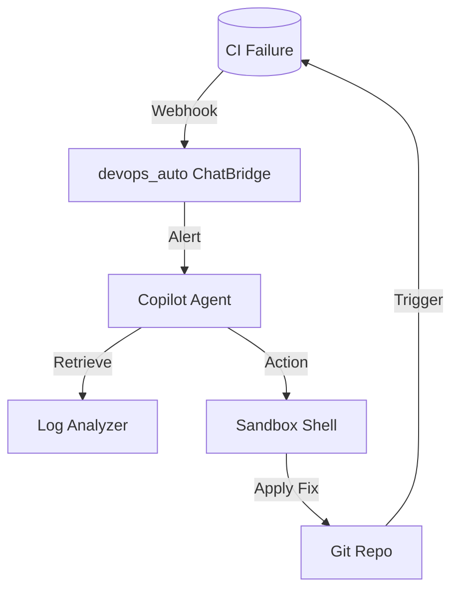

# DevOps Copilot Architecture

The DevOps Copilot is a specialized agent for CI/CD and system maintenance.

## Architecture Overview

## Core Components

- **Agent Node**: Orchestrates high-level sysadmin tasks using the ReAct loop.
- **Tools**: `run_shell`, `read_file`, `write_file` (all executed in the isolated `agentos_core.sandbox`).
- **Monitoring**: Leverages `list_processes` and `get_system_info` to detect resource leaks or downtime.
- **Security**: All actions are signed with JWTs and recorded in the `events` table in `agentos_memory` for full auditability.

## Automated Remediation Loop

1. **Detection**: Listens for webhooks from test runners or system monitors.
2. **Diagnosis**: Agent core reads failure logs and historical "thoughts" from memory to find patterns.
3. **Drafting**: Proposes a code change or config patch.
4. **Verification**: Spawns a dedicated `lane_queue` task to run tests against the changed state.
5. **Deployment**: On success, triggers the `deploy` module to update staging.
