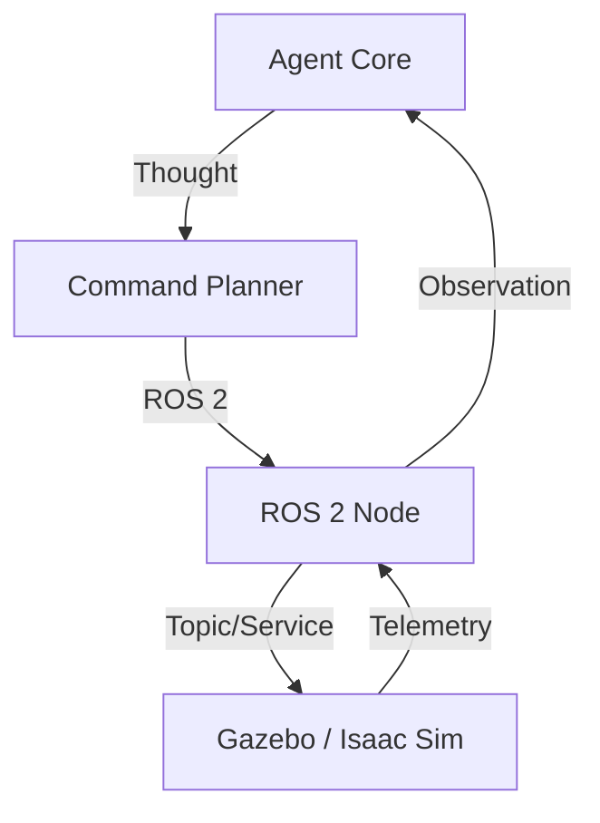

# Robotics & RL Architecture

The `robotics-rl-console` bridges the gap between high-level reasoning and physical control loops.

## Architecture Diagram

## Key Components

- **ROS 2 Node**: A long-lived process that maps Agent tool calls to ROS 2 actions and tracks robot telemetry.
- **Reward Shaper**: An internal module that uses LLMs to convert fuzzy goals (e.g., "walk smoothly") into numerical reward functions for RL training.
- **Sim Manager**: Manages the lifecycle of high-fidelity simulators, allowing the agent to "reset" the world for training iterations.
