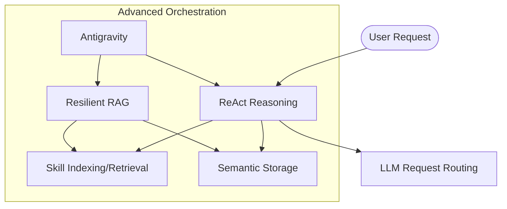

# Skills and Capabilities

This document is the authoritative catalog of the **Agentic OS** capabilities. It provides a structured overview of what the system can do, how skills are implemented, and how they are verified.

## Core Skills

### Skill: ReAct Reasoning

- **Category**: core
- **Description**: The primary reasoning engine implementing the Thought-Act-Observation loop.
- **Typical Use Cases**:
  - Complex problem solving.
  - Multi-step tool orchestration.
- **Inputs**: User message, session conversation history, retrieved semantic context.
- **Outputs**: Discrete reasoning steps (thoughts), tool invocations, and final formulated response.
- **Preconditions / Assumptions**: `LLMRouter` must be initialized and healthy.
- **Failure Modes**: Hallucination in tool arguments, exceeding maximum reasoning turns.
- **Implementation**: [agent_core/loop.py](agentos_core/agent_core/loop.py)
- **Tests**: [test_react.py](agentos_core/tests/test_react.py)
- **Related Skills**: [LLM Request Routing](#skill-llm-request-routing), [Semantic Storage](#skill-semantic-storage).
- **Signals / Metrics**: Success rate (task completion), average reasoning turns, latency per turn.

### Skill: LLM Request Routing

- **Category**: core
- **Description**: Transparent micro-batching of LLM requests to optimize local inference throughput.
- **Typical Use Cases**:
  - High-concurrency agent environments.
  - Optimizing GPU/CPU utilization for local providers like Ollama.
- **Inputs**: Raw prompt text from multiple concurrent agent sessions.
- **Outputs**: Batched inference results mapped back to original request futures.
- **Preconditions / Assumptions**: Local LLM provider (Ollama/vLLM) must be reachable.
- **Failure Modes**: Batch timeout reached with insufficient requests, backend service overload.
- **Implementation**: [llm_router/](agentos_core/llm_router/)
- **Tests**: [test_llm_router.py](agentos_core/tests/test_llm_router.py)
- **Related Skills**: [ReAct Reasoning](#skill-react-reasoning).
- **Signals / Metrics**: Average batch size, request wait time (ms), throughput (requests/sec).

### Skill: Semantic Storage

- **Category**: core
- **Description**: High-performance vector storage and similarity search using `pgvector`.
- **Typical Use Cases**:
  - Conversation memory retrieval.
  - Document/Context injection.
- **Inputs**: Text fragments or structured metadata for logging/querying.
- **Outputs**: Top-K ranked results based on cosine similarity of 768-d embeddings.
- **Preconditions / Assumptions**: PostgreSQL instance with `pgvector` enabled and `EMBED_MODEL` available in Ollama.
- **Failure Modes**: Embedding service latency, vector space collisions (low dimensionality).
- **Implementation**: [agent_memory/vector_store.py](agentos_memory/agent_memory/vector_store.py)
- **Tests**: [test_productivity_rag.py](agentos_core/tests/test_productivity_rag.py)
- **Related Skills**: [Resilient RAG](#skill-resilient-rag).
- **Signals / Metrics**: Retrieval precision@k, embedding generation latency.

## Advanced / Experimental Skills

### Skill: Antigravity (Agent-Level)

- **Category**: advanced | experimental
- **Description**: Meta-capability to "lift" system-level constraints and perform cross-subsystem orchestration and long-range dependency analysis.
- **Typical Use Cases**:
  - Root cause analysis across disconnected modules.
  - Discovering novel tool/skill combinations for unsolved tasks.
  - Performing higher-level system maintenance and optimization.
- **Inputs**: Cross-module documentation, full system logs, global task objectives.
- **Outputs**: Multi-stage implementation plans, cross-functional insights, system state modifications.
- **Lifting Mechanism**: It "lifts" the dimension of standard tool calls by analyzing the *relationships* between sub-systems (Memory <-> Skills <-> Core) rather than just calling individual functions.
- **Preconditions / Assumptions**: Access to root-level context and metadata for all sub-services.
- **Failure Modes**: State space explosion, conflicting subsystem goals.
- **Implementation**: [agent_core/antigravity.py](agentos_core/agent_core/antigravity.py)
- **Tests**: [test_antigravity.py](agentos_core/tests/test_antigravity.py)
- **Related Skills**: [Resilient RAG](#skill-resilient-rag), [Skill Indexing](#skill-skill-indexing).
- **Signals / Metrics**: Cross-module resolution rate, planning efficiency, "Insight lift" (new connections discovered).

### Skill: Skill Indexing

- **Category**: core
- **Description**: Automatic discovery and semantic chunking of `SKILL.md` packages.
- **Typical Use Cases**:
  - Onboarding new agent capabilities.
  - Keeping the knowledge base in sync with local capability updates.
- **Inputs**: File system paths to `SKILL.md` collections.
- **Outputs**: Indexed vector chunks and metadata in `pgvector`.
- **Preconditions / Assumptions**: `Semantic Storage` must be online.
- **Failure Modes**: Invalid Markdown structure in skill files, duplication of skill names.
- **Implementation**: [agent_skills/indexer.py](agentos_skills/agent_skills/indexer.py)
- **Tests**: [test_productivity_docs.py](agentos_core/tests/test_productivity_docs.py)
- **Related Skills**: [Semantic Storage](#skill-semantic-storage).
- **Signals / Metrics**: Sync latency, indexing coverage (found vs. indexed).

### Skill: Resilient RAG

- **Category**: advanced
- **Description**: Multi-tiered retrieval (Fractal, GraphRAG) with internal validation layers (Auditor, Strategist).
- **Typical Use Cases**:
  - Deep technical research.
  - Safety-critical knowledge retrieval.
- **Inputs**: User query, ambiguity threshold.
- **Outputs**: Verified context snippets with confidence scores.
- **Preconditions / Assumptions**: Knowledge base must be indexed.
- **Failure Modes**: Divergence in multi-hop reasoning, validation rejection (false negatives).
- **Implementation**: [agent_rag/](agentos_memory/agent_rag/)
- **Tests**: [test_productivity_rag.py](agentos_core/tests/test_productivity_rag.py)
- **Related Skills**: [Semantic Storage](#skill-semantic-storage), [Skill Indexing](#skill-skill-indexing).
- **Signals / Metrics**: Hallucination rate (verified), context relevance score.

## Skill Graph and Dependencies

## Extension and Integration Points

- **New Core Tools**: Register in `agentos_core/agent_core/tools/`.
- **New Specialized Skills**: Drop a `SKILL.md` into `agentos_skills/skills/`.
- **Domain Modules**: Create internal modules in `agentos_core/` (like `devops_auto`).

## Next Skills to Add (Roadmap)

1. **Multi-modal Visual Reasoning**: Ability to process image-based tool outputs for UI automation.
2. **Self-Healing CI/CD**: Integration with `devops_auto` to automatically fix build failures detected in logs.
3. **Federated Memory Sync**: Protocol for syncing semantic memory across multiple Agent OS instances securely.
